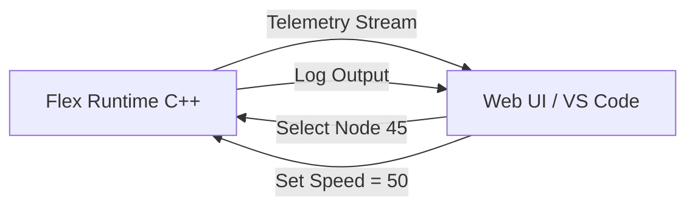

Yes, absolutely. For an engine of this complexity, **Tooling is just as important as the Runtime.**

You cannot expect users to build complex CAD tools or Games if they are blind to what the engine is doing. You need to implement a **Flex DevTools Protocol**.

This works similarly to **Chrome DevTools** or **React DevTools**. The running engine acts as a **Server**, and a separate UI (or VS Code extension) acts as the **Client**.

Here is the design for the **Flex Debugging & Profiling Ecosystem**.

---

### 1. Architecture: The Debug Bridge (WebSocket)

The Flex Runtime (C++) starts a lightweight WebSocket server (e.g., on port `8080`) when the `FLUX_DEBUG` flag is active.

*   **The Runtime (Server):** Sends telemetry, log messages, and state snapshots.
*   **The DevTools (Client):** Sends inspection commands, hot-reload scripts, and property changes.



---

### 2. DSL Integration: The `Debug` Block

We add an optional top-level block to the DSL to configure debug behavior.

```flex
Debug {
    enabled: true
    port: 8080
    
    // VISUAL AIDS
    showDirtyRects: true   // Flash red boxes when things redraw
    showWireframe: false   // Show vector paths
    showBones: true        // Draw skeleton lines
    showHitboxes: true     // Draw transparent blue on clickable areas
    
    // LOGGING
    logLevel: info         // error, warning, info, verbose
    traceTransitions: true // Log every State Machine change
}

Scene "Main" { ... }
```

---

### 3. Feature A: The Live Inspector (The DOM Tree)

Just like "Inspect Element" in a browser.

**How it works:**
1.  **Request:** DevTools sends `{"cmd": "getTree"}`.
2.  **Response:** Engine serializes the current Scene Graph to JSON (stripping binary data, keeping hierarchy and IDs).
3.  **Highlight:** Hovering a node in DevTools sends `{"cmd": "highlight", "id": 123}`. The Engine draws a customized overlay on that node.

**Live Editing:**
If you change a color in DevTools, it sends `{"cmd": "propSet", "id": 123, "key": "Fill.color", "val": "#FF0000"}`. The engine applies this instantly without reloading.

---

### 4. Feature B: State Machine Debugger

Debugging logic is harder than debugging visuals. We need to visualize the **Brain**.

**The Visualization:**
*   **Active State:** Highlighted Green.
*   **History:** A list of recent transitions.
*   **Input Watcher:** A table showing live values of all `$Inputs`.

**The Protocol Message:**
```json
{
  "type": "state_change",
  "machine": "Controller",
  "layer": "Movement",
  "from": "Idle",
  "to": "Run",
  "trigger": "$Speed > 0",
  "timestamp": 162000234
}
```

**DSL Feature: Breakpoints**
You can define breakpoints directly in the DSL to pause execution when a specific state is entered.

```flex
State Exploding {
    // PAUSE ENGINE when entering this state
    debug: break 
    
    play "Boom"
}
```

---

### 5. Feature C: The Profiler (Performance)

We need to know *why* the app is slow. Is it the Script? The Rendering? The Physics?

**1. The Flame Graph (CPU)**
We integrate the **Tracy** profiler (as mentioned in the tech stack) but expose a simplified version to the Flex DevTools.

**2. The Heads-Up Display (HUD)**
The engine can render an overlay showing real-time stats.

```flex
Debug {
    showOverlay: true
}
```
*   **FPS:** 59.8
*   **Draw Calls:** 12
*   **Node Count:** 5,400 (Pool Usage: 45%)
*   **Memory:** 12.4 MB
*   **Script Time:** 2ms
*   **Render Time:** 8ms

**3. Hot Zones (GPU)**
The engine can overlay a "Heatmap" showing Overdraw (pixels drawn multiple times). Red areas = Bad performance.

---

### 6. Feature D: Script Debugging (QuickJS)

QuickJS supports the **Chrome DevTools Protocol (CDP)**. This is a massive win.

**Implementation:**
1.  The Flex Engine exposes the QuickJS context via a socket.
2.  You open **Chrome** (chrome://inspect).
3.  Chrome detects "Flex Engine".
4.  You get the **full Chrome Debugger** for your JavaScript:
    *   Breakpoints.
    *   Step Over/Into.
    *   Variable Inspection.
    *   Console.

**DSL Hook:**
```javascript
// inside logic.js
function onUpdate() {
    let score = flex.getInput("Score");
    if (score < 0) {
        debugger; // This triggers a breakpoint in Chrome!
    }
}
```

---

### 7. Feature E: Time Travel (Snapshotting)

Since the `FlexInstance` is separated from the `FlexDefinition`, the entire state of the application is just a small memory block (Inputs + Current Time + Node Properties).

**How to implement:**
1.  **Record:** Every frame (or every input change), push the `FlexInstance` state to a Ring Buffer in memory (Circular history).
2.  **Scrub:** The DevTools has a slider. Moving it sends `{"cmd": "restoreState", "index": -50}`.
3.  **Replay:** The engine rewinds variables and positions instantly.

**Why this is useful:**
If a physics explosion looks wrong, the designer can pause, rewind 2 seconds, and play it again in slow motion to see exactly what happened.

---

### 8. Implementation Guide (C++)

Here is how you add the Debug Server to your engine.

```cpp
// DebugServer.h
class DebugServer {
public:
    void init(int port);
    void update(); // Check for incoming messages
    
    // Telemetry
    void sendNodeTree(Node* root);
    void sendLog(const char* msg);
    
    // Command Handling
    std::function<void(int id)> onHighlight;
    std::function<void(int id, string prop, float val)> onPropChange;
};

// MainLoop.cpp
void frame() {
    // 1. Standard Logic
    ui->advance(dt);
    
    // 2. Debug Instrumentation
    #ifdef FLUX_DEBUG
        if (ui->isDirty()) {
            debugServer->sendNodeTree(ui->getRoot());
        }
        
        // Check for "Pause" command from client
        if (debugServer->isPaused()) return;
    #endif
    
    // 3. Render
    ui->render(renderer);
    
    // 4. Debug Overlays
    #ifdef FLUX_DEBUG
        if (settings.showHitboxes) drawDebugRects(renderer);
    #endif
}
```

### Summary

To support complex apps, debugging cannot be an afterthought.

1.  **Visuals:** Use **Overlays** (Wireframes, Hitboxes).
2.  **Logic:** Use a **WebSocket Bridge** to a custom web inspector.
3.  **Scripts:** Use standard **Chrome DevTools Protocol** via QuickJS.
4.  **Performance:** Use on-screen **HUD** statistics.

This transforms Flex from a "Black Box" into a professional-grade development platform.