# FlexUI Desktop 应用运行时设计

- 状态：分阶段实施中（XML/CSS/TurboScript/DLL/gCanvas editor 闭环已落地；dirty binding、
  错误 UI 与完整 package discovery 尚未完成）
- 日期：2026-09-01
- 首要平台：Windows 桌面，OpenGL 为默认渲染后端
- 控制器语言：TurboScript
- 扩展方式：版本化纯 C ABI DLL 应用服务插件
- 实施清单：[FLEXUI_DESKTOP_PLAN.md](FLEXUI_DESKTOP_PLAN.md)
- 关联设计：[FLEX_UI_DOCUMENT_DESIGN.md](FLEX_UI_DOCUMENT_DESIGN.md)、
  [TURBOSCRIPT_CONTROLLER_DESIGN.md](TURBOSCRIPT_CONTROLLER_DESIGN.md)、
  [ARCHITECTURE.md](ARCHITECTURE.md)

> **2026-08-31 决策更新：** 本文关于“`.flex` 是核心 UI 文档、XML 仅为可选 adapter”的结论已由
> [XML_CSS_TBS_ARCHITECTURE.md](XML_CSS_TBS_ARCHITECTURE.md) 取代。当前目标是 XML 负责结构、
> CSS/Tailwind-like 负责样式与声明式动画、TurboScript 负责交互；原生 Timeline/Physics/MIR
> runtime 保留。本文的 controller ABI、状态所有权、事务和线程模型章节仍然有效。

## 1. 决策摘要

FlexUI Desktop 采用类似 Qt Designer `.ui` + QtScript 的开发模型，但不复制 QObject 或浏览器 DOM：

```text
XML UI Document + CSS/Tailwind Utility + TurboScript Controller
                              │
                              ▼
                   native FlexUI runtime
                              │
                              ▼
                    gCanvas / OpenGL GPU
```

核心决策如下：

1. XML 是唯一目标 UI 文档格式；迁移期旧 `.flex` 与 XML 产生同一个
   `UiDocumentDefinition`，消费者迁移和等价测试完成后删除旧 DSL。
2. 新增编译后的 `CompiledUiProgram`，集中保存 UI definition、事件绑定、MIR binding、
   source map 和资源引用；不把脚本值或运行时指针放进 definition。
3. TurboScript 是首选且可修改的控制器运行时，不再同时设计 QuickJS/JavaScript 路径。
4. 每个 `Box` 至多一个窗口级 controller；脚本通过事件快照读取输入，通过有界命令批次
   请求修改 UI，不持有 `Element*`。
5. DLL 用于扩展应用服务与 TurboScript host module；插件通过版本化纯 C ABI 和 opaque
   handle 接入，不直接操作 Box、Element、Renderer 或 gCanvas Context。
6. `DesktopApplication` 是装载和运行 Facade；桌面窗口系统与 gCanvas backend 通过 Bridge
   隔离，初始实现可以包装 `gCanvas::Window`，但 FlexUI Core 不依赖 GLFW。
7. 所有装载均构建候选实例；解析、插件、脚本、handler resolution 或 mount 任一失败，
   都销毁候选实例，不发布半初始化应用。

## 2. 背景与仓库事实

### 2.1 事实

- `UiDocumentDefinition` 已是 parser-independent 值语义树，并带 source、node、depth、property
  和 string 资源上限；`UiDocumentInstantiator` 承诺失败时目标 Box 不变。证据：
  `flexUI/include/flexUI/ui_document.h`、`flexUI/src/ui_document.cpp`。
- XML 与 legacy `.flex` frontend 都会把事件降级为同一个不可变类型化事件表，并提供按
  element/event 查询的只读索引。`ScriptController::load()` 在候选发布前解析 required export，
  `dispatch()` 已能提交类型化 mutation；`EventDispatcher` 自动接入 controller 尚未实现。证据：
  `flexUI/include/flexUI/ui_xml.h`、`flexUI/modules/controller/controller.cpp`、
  `flexUI/modules/controller/application.cpp`。
- `UiDataContext` 是单线程类型化输入事实源；数值和布尔表达式创建 binding 时编译为 MIR，
  输入版本不变时跳过求值。证据：`flexUI/include/flexUI/binding_runtime.h`、
  `flexUI/src/binding_runtime.cpp`。
- `EventDispatcher` 已集中处理 hit-test、widget consumption、焦点、捕获和冒泡；它应继续作为
  原生事件到脚本事件的唯一转换边界。证据：`flexUI/include/flexUI/event_dispatcher.h`、
  `flexUI/src/event_dispatcher.cpp`。
- `FlexUI::TailwindCSS` 已是独立静态模块，Core 负责 Element 扫描与 stylesheet 应用。证据：
  `flexUI/modules/tailwindcss/CMakeLists.txt`、`flexUI/docs/ARCHITECTURE.md`。
- gCanvas 已把核心 renderer 与可选 GLFW window helper 分离；OpenGL/Vulkan Context 支持
  host-managed native window，Context 与 GPU 资源限定在创建线程。证据：
  `vendor/gCanvas/CMakeLists.txt`、`vendor/gCanvas/docs/host-and-resource-protocol.md`。
- TurboScript public host ABI 已能编译模块、按名称解析 export、重复调用并返回结构化错误；
  FlexUI 通过可选 `FlexUI::ControllerTurboScript` adapter 使用它，feature 关闭时不查找该依赖。
  证据：`flexUI/include/flexUI/controller_turboscript.h`、
  `flexUI/modules/controller/controller_turboscript.cpp`。

### 2.2 推论

- 类似 Qt 的生产力来自“声明式视图、类型化属性、signal/slot、脚本 controller 和原生服务”，
  并不依赖 XML 本身。
- XML 与 `.flex` 若拥有各自 runtime 会复制语义验证、source map、热重载和测试矩阵；当前实现
  因此只保留双 frontend，并统一输出 `CompiledUiProgram`，XML 是默认入口。
- TurboScript 与 DLL 都必须经过窄宿主边界；把 native pointer 暴露给脚本或 DLL 会破坏
  Box ownership、线程约束和后续 backend 替换能力。

## 3. 目标与非目标

### 3.1 目标

- 首先交付可制作复杂桌面 GUI 的 Windows application runtime。
- 使用 XML 声明 UI、CSS/Tailwind 描述视觉、MIR binding 投影状态、TurboScript 编排行为。
- 支持 C/C++ DLL 注册类型化业务服务，并由 TurboScript 通过 capability namespace 调用。
- 保持 Element、binding input、controller、plugin private state 和 GPU resource 各有唯一 owner。
- 无脚本页面不进入脚本 callback；无动画窗口按需重绘。
- 所有加载、callback、mutation 和 plugin 错误都结构化、可定位、fail fast。
- 保持现有手写 Box、现有 `.flex ui` 文档和无 TurboScript build 的行为稳定。

### 3.2 非目标

- 不实现 HTML、DOM、CSSOM、JavaScript/TypeScript、Node.js、npm 或 Web API 兼容层。
- 不允许脚本遍历整棵 UI tree、直接绘制或逐 property/逐 animation track 执行脚本。
- 不允许 DLL 插件直接调用另一个插件或获得内部 C++ 对象地址。
- 首版不承诺 DLL 热重载、崩溃隔离或运行不可信第三方插件。
- 首版不以移动端、WebAssembly、嵌入式或低于当前 gCanvas backend 要求的 GPU 为目标。
- 不用 TurboScript 替代 CSS cascade、layout、Timeline、easing 或 MIR binding。

## 4. 候选方案

| 方案 | 优点 | 代价与风险 | 结论 |
|---|---|---|---|
| XML + JavaScript runtime | 接近传统 Qt `.ui`，外部工具容易生成 XML | JS runtime、GC 和 Web 预期扩大范围 | 不采用 JavaScript |
| XML + TurboScript + native runtime | 结构可由工具生成；复用现有 IR、MIR、Box 和事件系统 | 需要 XML schema、typed widget factory 和迁移旧消费者 | 采用 |
| `.flex` + TurboScript + native runtime | 复用现有 parser | UI、动画、状态机和表达式职责重叠 | 仅作迁移兼容 |
| 纯 C++ UI + callback | 最小运行时、静态类型强 | 声明式生产力和快速迭代不足，无法满足 QtScript 类需求 | 保留兼容，不作为主路径 |
| 脚本直接操作 Element/DOM | API 表面灵活 | 生命周期、线程、性能和状态一致性不可控 | 禁止 |

## 5. 总体架构

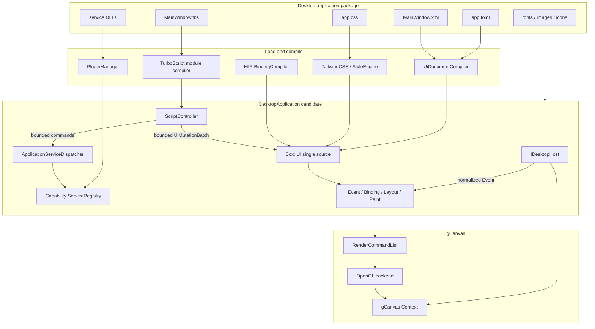

### 5.1 模块依赖

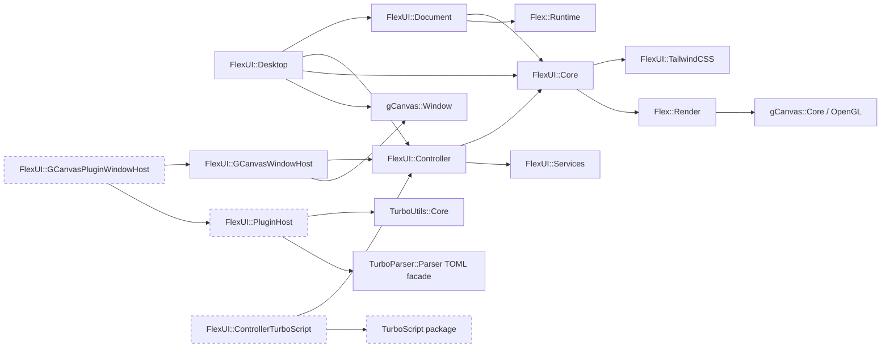

依赖必须单向。`ApplicationServiceDispatcher` 位于 `FlexUI::Controller`，只依赖 application facade 与
`FlexUI::Services`；它不依赖 PluginHost、动态库 loader 或平台窗口。PluginHost 只是可选的 registry
生产者。`FlexUI::GCanvasPluginWindowHost` 只在 PluginHost 和 gCanvas window target 同时存在时生成，
负责组合两者的所有权；独立的 `FlexUI::GCanvasWindowHost` 仍不依赖 PluginHost。TurboScript、DLL
loader、GLFW 和平台头不能出现在 `FlexUI::Core` 公共头中。

### 5.2 设计模式边界

- `DesktopApplication`：Facade，封装插件、文档、样式、脚本、窗口和 GPU 的构建顺序。
- `DesktopApplicationBuilder`：Builder，承载多项可选配置和严格 build validation。
- `IDesktopHost` / `GCanvasWindowHost`：Bridge + Adapter，隔离平台窗口与 gCanvas helper。
- `IScriptModule` / `TurboScriptModule`：Strategy + Adapter，隔离 controller 与脚本 ABI。
- `ApplicationServiceDispatcher`：有界 owner-thread Mediator，隔离 application request 与具体 endpoint。
- `UiMutation`：`std::variant` Command，已知有限操作集合，不建立深继承树。
- `PluginManager`：生命周期 Facade；插件间只经过 service registry 或 event queue。
- `ControllerState`：显式 State machine，禁止散落布尔状态控制 reload/fault。

## 6. 应用包与配置

建议的应用目录：

```text
my_app/
├── app.toml
├── ui/MainWindow.xml
├── styles/app.css
├── controllers/MainWindow.tbs
├── plugins/document_service/plugin.toml
├── plugins/document_service/document_service.dll
└── assets/
```

概念配置如下；字段名在实现 API 冻结时再形成正式 schema：

```toml
[application]
id = "com.example.editor"
entry_document = "ui/MainWindow.xml"
entry_controller = "controllers/MainWindow.tbs"
stylesheets = ["styles/app.css"]

[window]
title = "Editor"
width = 960
height = 640
backend = "opengl"

[[plugins]]
manifest = "plugins/document_service/plugin.toml"
required = true
capabilities = ["document.read", "document.write"]
```

配置优先级遵循：命令行显式覆盖 > 环境变量 > `app.toml` > 命名默认配置。应用启动时完成
schema、路径、资源上限和 required capability 校验；非法配置直接失败，不静默修复。

## 7. UI Document 与编译 IR

### 7.1 目标语法

现有属性保持兼容。P1 首批已实现的 `bind.*` 语法如下：

```flex
ui MainWindow {
    div root {
        utility: "flex min-h-screen flex-col",

        button save {
            text: "Save",
            utility: "rounded-md px-4 py-2",
            bind.class_enabled: ${can_save},
            on.click: "save_document"
        },

        div status {
            bind.text: $document_status
        }
    }
}
```

P1 当前刻意限定的首批 target 子集是 `text`、`classes`、`utilities` 和 `class_<token>`。
binding runtime 已有的单 utility、attribute 与 custom property 尚未定义稳定的 DSL 命名，不能把
这一首批子集理解为普通 `Element` 的能力上限。`bind.value` 需要 `TextValueWidget` 和双向 observer，而当前 document builder
只创建普通 `Element`，因此编译阶段明确拒绝；后续只有在 widget factory 进入同一装载事务后才可开放。
string target 使用单一 `$input`，class toggle 使用 `${boolean_expression}` 并在安装时校验其
number/bool 输入已经声明。编译产物中的 immutable MIR JIT artifact 由 program 与已安装 binding
共享，不在每次实例化时重新编译；不具备 JIT artifact 时安装直接失败，禁止跨 Box 共享 MIR
interpreter 的可变 context。任一绑定安装失败都会回滚本批绑定、句柄序列和 candidate tree。

解析器继续保持普通 node property 的既有 last-write-wins 行为，但会额外记录重复属性的后一处
source span；FlexUI validation 对重复 `on.*` 和 `bind.*` 单独 fail fast，不让 handler 或 binding
因 map 覆盖而静默改变。binding lowering 在同一 element 内按 source span 排序后检查 ownership：
`bind.classes`/`bind.utilities` 独占完整 class list，不能与另一完整 list binding 或任意
`bind.class_<token>` 共存；不同 token 的 class binding 可以共存。runtime 的 ownership 校验仍然
保留，覆盖手工 API 调用并防止 compiled/load 边界被绕过。

### 7.2 不修改现有 Definition 契约

不向 `UiNodeDefinition` 塞入 runtime handle。新增只读编译产物：

```text
CompiledUiProgram
├── shared_ptr<const UiDocumentDefinition>
├── EventBinding[]
├── BindingDefinition[]
├── UiResourceDefinition[]
├── interned Symbol table
├── SourceMap
└── declared capabilities
```

建议的概念类型：

```cpp
enum class UiBindingTargetKind {
  Text,
  Value, // 为公开枚举的源兼容保留；document lowering 暂不生成
  Classes,
  Utilities,
  ClassToggle
};

struct EventBinding {
  flex::Symbol element_id;
  UiEventKind event;
  flex::Symbol handler;
  SourceSpan source;
};

struct BindingDefinition {
  flex::Symbol element_id;
  UiBindingTargetKind target_kind;
  flex::Symbol target_name;
  MirProgramId program;
  SourceSpan source;
};
```

当前实现使用 `std::string` 保存 element/input 名称，并把 MIR program 留在
`CompiledUiProgram::Impl`；symbol interning 仍是后续 load-path 优化，不是 P1 正确性前提。
现有顶层 `assets {}` 会在同一次 parse 中 lower 为 parser-independent、只读的
`UiResourceDefinition[]`；`UiDocumentLimits::max_resources` 在发布 compiled program 前限制条目数，
超限返回 `ResourceLimitExceeded`，不截断资源表。资源表只描述 type、id、path 和 literal options，
不持有 gCanvas、文件或插件句柄。
`on.*` 的旧
`data-flexui-on-*` attribute 在迁移期可继续由 `EventBinding` 派生，保证现有查询和测试不变，
但 handler table 是唯一事实源，attribute 不能反向修改 handler。`CompiledUiProgram` 通过
`find_event_binding(element_id, event)` 提供只读索引查询；索引以 element `Symbol` 分桶并在命中后
比较完整 element ID 和 event kind，因此不把 32 位 hash 相等误当成身份相等。compatibility
attribute 的修改或删除只改变 Element metadata，不改变查询结果。controller 必须持有共享的
compiled program，Box 和 Element 不维护第二份 handler 状态。

### 7.3 查找复杂度

- load 阶段把 element ID、event name、handler name intern 为 symbol。
- handler resolution 在 load 阶段完成；事件路径按 element handle 和 event kind 做 O(1) 或
  有界哈希查找，不扫描 Element tree。
- binding 表达式只编译一次；运行时沿用输入 version 判定。
- 不提供通用脚本 `querySelectorAll` 热路径；确需查询时由宿主返回有容量上限的 handle snapshot。

## 8. TurboScript Controller

### 8.1 决策

TurboScript 是确定的 controller runtime。FlexUI 仍保留内部 `IScriptModule`，目的不是同时支持
多种脚本语言，而是：

- 隔离 TurboScript C ABI 和生命周期。
- 允许 fake module 做确定性单元测试。
- 防止 exprtk/MIR 内部类型泄漏到 FlexUI 公共 API。
- 让 TurboScript 自身可以独立演进和发布 DLL/static package。

### 8.2 TurboScript 必须补齐的能力

- compiled/module handle 真正持有已解析和 lower 的产物，重复调用不重新解析源码。
- 查询 named export、按名称调用 export，并缓存已解析的 export handle。
- 公开 number、bool、string、null、受限 array/record 的 tagged value 与明确所有权。
- 返回 status + structured error，不用 stdout 作为错误通道。
- 支持 recursion、step、stack、memory、wall-clock/interrupt 预算。
- 规定 context 单线程约束、字符串生命周期和 interrupt 后的销毁/reload 语义。
- 导出可安装的 `TurboScriptConfig.cmake` target，避免把两个仓库源码 target graph 合并。

这些修改在 TurboScript 仓库实施；FlexUI 仅依赖其稳定 public package。

### 8.3 生命周期

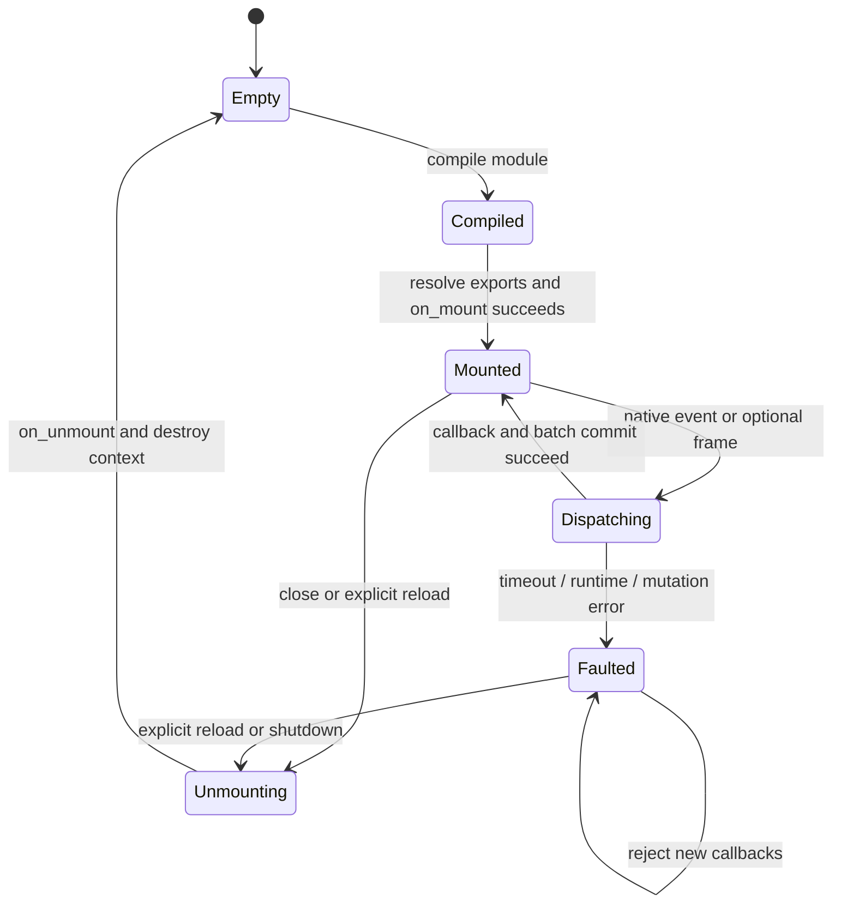

每个 Box 最多一个 controller，且 controller、Box、EventDispatcher 和 gCanvas Context 都由同一个
UI 线程访问。`on_frame` 只有模块显式导出且宿主启用时才进入帧路径。

### 8.4 Controller core 数据协议

- `ScriptController` 独占一个 `IScriptModule`，并以 `shared_ptr<const CompiledUiProgram>` 保持
  handler table 的唯一事实源存活；load 失败时候选 module 在函数边界内销毁，活动 Controller
  仍为 `Empty`。
- `IScriptModule` 仅解析 export 并调用已解析的 opaque handle。生命周期 export 和所有
  `EventBinding` 在 load 阶段解析，事件 dispatch 不重复解析 handler 名称。
- `ScriptEventSnapshot` 是不含 `Element*` 的值类型。`ScriptCallContext::event` 是同步调用期间的
  borrowed view，只在 `IScriptModule::call()` 返回前有效；module/adapter 不得保存该指针。
- 该阶段是单生产者、单消费者、同一 UI 线程的直接调用，没有队列和跨线程发布。
  `ControllerLimits` 分别限制 element ID、event text 和 composition text 字节数；超限返回
  `EventLimitExceeded`，不调用 module、不截断输入，也不改变 `Mounted` 状态。
- module 返回错误或抛异常时，Controller 将其转换为一个 `ModuleCallFailed`，丢弃当次结果并进入
  `Faulted`；后续 callback 返回 `ControllerFaulted`。显式 unmount/load 是唯一恢复路径。
- unmount 先进入 `Unmounting` 并调用可选 `on_unmount`，再释放 module 和 compiled program；
  即使 `on_unmount` 失败也完成资源释放并返回结构化错误。

### 8.5 脚本能力

脚本可：

- 读取不可变 `ScriptEventSnapshot`。
- 读取显式暴露的 `UiDataContext` snapshot。
- 提交有界 `UiMutationBatch`。
- 调用 manifest 授权的 application service。
- 启动/停止命名动画，或向 C++ service 提交长任务。

脚本不可：

- 持有 `Element*`、Widget、Renderer、gCanvas resource 或 DLL 函数指针。
- 修改 layout/render cache 或在 paint callback 中执行脚本。
- 直接打开文件、socket、进程或 native dialog；必须调用 capability service。
- 在工作线程调用 Box 或 controller。

## 9. DLL 应用服务插件

### 9.1 定位

DLL 插件用于扩展业务能力，例如文档读写、数据库、设备、系统集成或专用算法。它不是另一套
UI component tree，也不是 renderer backend。插件向 host 注册版本化服务；TurboScript 通过
`service.call("document.storage/1", "save", args)` 之类的受限 bridge 调用。

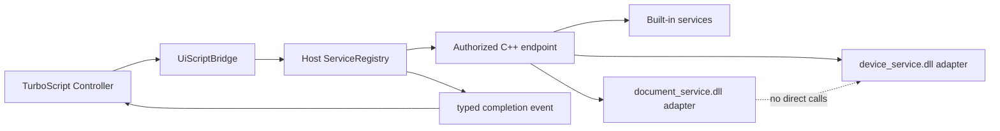

### 9.2 ABI 规则

冻结 ABI 的事实源是 `include/flexUI/plugin_abi.h`。跨 DLL 边界只使用纯 C、定宽整数、显式长度
buffer、函数表和 opaque handle；固定入口为 `flexui_plugin_get_api_v1`，当前 ABI 为 `1.0`。
可编译的完整实现与 host 测试分别见 `tests/plugin_test_echo.cpp` 和 `tests/test_plugin_host.cpp`。

ABI 契约：

- major 必须等于 1；插件 descriptor 的 `required_host_minor` 不得高于 host minor。函数表与可扩展
  descriptor 用 `struct_size` 做 prefix 检查，并保留清零的 reserved slots。
- 使用平台默认自然 packing；插件不得用不同的 `#pragma pack` 编译 ABI struct。Windows 调用约定固定
  为 `__cdecl`，visibility 由 `FLEXUI_PLUGIN_EXPORT` 控制。
- request、descriptor 和 completion 的 pointer + length view 都是 borrowed。插件在成功 `submit()`
  返回前复制要保留的 request；host 在 `post_completion()` 返回前复制 completion。
- error buffer 始终由调用方分配并由调用方释放；callee 只写 UTF-8 bytes 和 `message_size`。host 与
  plugin 不释放对方内存，也不允许异常越过 C ABI。
- `post_completion()` 可由多个插件 worker 并发调用；`QueueFull`/`ResourceLimit` 保留活动 token，
  插件可重试。成功或 terminal error 消耗该 token，重复/未知 token 返回 `Stale`。

### 9.3 插件生命周期

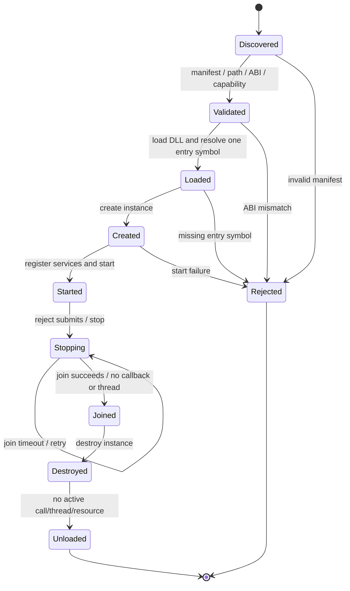

首版只支持启动加载和关闭卸载。热重载必须在后续阶段满足以下条件后单独启用：

- 所有 service call 引用清零。
- 插件创建的线程全部停止并 join。
- 未完成 completion 被取消或迁移。
- 旧插件状态通过版本化 schema 导出，新插件验证后导入。
- 新插件 start/health check 成功后原子切换 service routing；失败保留旧版本。

同进程 DLL 无法提供真正的崩溃隔离。首版只加载可信插件；不可信插件必须以后通过独立进程和
IPC service adapter 隔离，不能用 signal/SEH 后继续运行可能已损坏的进程。

### 9.4 插件依赖与权限

`PluginHostBuilder::load_manifest()` 显式接收绝对 `plugin.toml` 路径；首版不扫描目录。manifest
在加载任何对应 DLL 前完成有界读取、TOML/schema、路径、权限和依赖图验证：

```toml
manifest_version = 1
name = "document.storage"
version = "1.2.0"
library = "flexui_document_storage.dll"
services = ["document.storage/1"]
capabilities = ["settings.read/1"]
permissions = ["file"]

[abi]
major = 1
minor = 0

[[dependencies]]
name = "settings.core"
version = "1.0.0"
optional = false
```

- `name` 与 DLL `plugin_id` 使用同一 canonical lowercase 语法；`version` 使用 canonical SemVer
  2.0.0。manifest v1 的依赖版本是精确匹配，`>=`、`<`、`^` 等 range 语法直接拒绝，后续可在不
  改变精确匹配含义的前提下扩展 requirement grammar。
- `library` 只能是相对路径；manifest 与 DLL 均 canonicalize，DLL 最终路径必须仍位于 manifest
  package 目录内。symlink/traversal 不能逃逸目录。
- `services` 必须与 DLL descriptor 的 capability 集合完全相等；`capabilities` 是 final immutable
  registry 中必须存在的 required service。ABI 1.0 尚不向插件开放 service lookup，因此它当前是加载
  契约，不是插件间直接调用通道。
- required dependency 缺失或版本不符立即失败。只有显式 `optional = true` 才允许缺失；如果 optional
  dependency 实际存在，其版本仍必须匹配，并参与拓扑顺序。循环依赖直接拒绝。
- `PluginHostPolicy` 默认不授予任何 `file`、`network`、`process`、`device` 权限。权限检查是可信
  in-process DLL 的加载准入策略，不是 OS sandbox；原生 DLL 仍可能绕过 host API 直接调用平台能力。
  不可信插件必须使用后续独立进程/IPC host。
- `load_plugin(absolute DLL)` 为既有可信嵌入兼容入口，不声明依赖与权限；应用可逐插件迁移到
  `load_manifest()`，失败时不涉及数据迁移，可恢复原调用。

### 9.5 当前 C++ ServiceRegistry 与 PluginHost 边界

`FlexUI::Services` 已提供独立于 Controller、窗口、TurboScript 和动态库加载器的 C++ registry：

- `ApplicationServiceRegistryBuilder` 只允许创建它的 owner thread 注册，并在 `build()` 时生成不可变
  `shared_ptr` snapshot；snapshot 可由 request queue 和 host 安全共享。
- capability 固定为 `<namespace>/<major>`，例如 `document.storage/1`；operation 使用受限小写 ASCII
  标识符。默认最多 64 个 service、每个 service 64 个 operation、标识符 256 bytes，单 operation
  payload 默认 16 KiB 且不得超过 registry 的 64 KiB 总上限。
- application manifest 明确区分 `allowed` 和 `required`；required 必须属于 allowed，并且 build 时必须
  已注册。未配置 registry 等价于空 snapshot，而不是隐式开放全部能力。
- request queue 持有 registry snapshot 与 manifest 的唯一运行时副本。controller callback 的 command
  batch 在申请 slot、提交同批 UI mutation 之前校验授权、service、operation 和 payload 长度；任一失败
  整批不发布，UI 也不改变。
- host 取得 owning request 后通过 `resolve_service_request()` 重复防御性校验并获得同一个
  `shared_ptr<IApplicationServiceEndpoint>`。Registry 只解析，不调用 endpoint；`try_submit()` 的成功表示
  endpoint 已复制需保留的数据并承担一次同 token completion 投递，失败则不得保留 request/sink。

`FlexUI::PluginSDK` 始终提供纯 C header；`FLEXUI_ENABLE_PLUGINS=ON` 时才生成
`FlexUI::PluginHost` 和平台 loader。manifest TOML 通过已安装 `TurboParser::Parser` 的 explicit-length
facade 解析；不开插件时不应引入 PluginHost/TOML 运行路径。PluginHost 目前完成以下边界：

- builder 可接收调用方给出的绝对 DLL 或 manifest 路径；Windows 使用受限 `LoadLibraryExW` 搜索 flags，
  Unix 使用 `RTLD_NOW | RTLD_LOCAL`。manifest candidate 先完成全图解析，之后按 dependency-first 顺序
  load/create；registry build、required capability validation 与 start 仍是一个 publication transaction。
  失败不发布 registry，已 start 的 candidate 逆序 stop/join。
- descriptor 在 DLL 卸载前复制到 host-owned C++ storage，再与 built-in endpoint 一起生成不可变 registry。
  插件默认最多 16 个，每个插件最多 256 个 in-flight request；槽表构建时一次预分配，满时返回 Busy，
  不扩容、不阻塞、不丢弃。
- 请求槽状态为 `Free -> Active -> Posting -> Free`。mutex 只保护槽与统计，锁内不分配、不调用 plugin、
  sink 或平台 API。同步 completion 和多 worker completion 使用同一协议。
- stop 先一次性拒绝所有 endpoint 新调用，再等待正在执行的 submit 退出，调用 plugin stop/join。join
  timeout 保持 DLL、instance、slot 和 `Stopping` 状态，可在 owner thread 重试；成功 join 后才 abandon
  未完成 token、destroy 和 unload。
- completion sink 是非拥有指针。因此调用方必须在销毁 `DesktopApplication`/mailbox 前成功 stop PluginHost；
  PluginHost 析构的无限 join 是防止 use-after-unload 的安全网，不替代正确销毁顺序。
- 可选 `GCanvasPluginWindowHost::create()` 消费完整的 `PluginHostBuildResult`，要求 host 处于 `Started`、
  与调用线程共享 owner thread，且 registry 必须与 `PluginHost::registry()` 是同一 snapshot。验证成功后，
  它把该 snapshot 和显式 capability manifest 注入 `DesktopApplicationBuilder`，因此 application request
  table 与插件 endpoint 不会维护两份 routing 状态。任何不一致都在创建窗口前失败。

当前仍只承载受限 opaque payload 和长度契约，尚未实现 tagged value/schema、目录 discovery、权限
API mediation/OS sandbox、签名验证、热重载和进程隔离。因此“可加载”
只适用于调用方显式指定的可信 DLL，不表示可运行任意第三方 DLL。

### 9.6 Plugin SDK 安装与版本契约

安装树以 `FlexUIConfig.cmake` 为唯一入口，并把插件边界拆成三个可检查组件：

| CMake component | target | 依赖与用途 |
|---|---|---|
| `PluginSDK` | `FlexUI::PluginSDK` | 始终存在；纯 C ABI header，不引入 loader 或 parser |
| `Services` | `FlexUI::Services` | C++ registry、descriptor、request/completion contract |
| `PluginHost` | `FlexUI::PluginHost` | 仅 `FLEXUI_ENABLE_PLUGINS=ON`；依赖前两者及 TurboUtils/TurboParser |

三者属于同一个 `FlexUIPluginTargets` export set，避免 export 文件引用未安装的源码树 target。安装命令可用
`--component FlexUIPlugin` 只部署该闭包；外部工程通过
`find_package(FlexUI 1.0 CONFIG REQUIRED COMPONENTS PluginSDK PluginHost)` fail fast 检查能力。
`TurboUtils_DIR` 与 `TurboParser_DIR` 由消费方 profile 指向精确安装根，包配置不写入构建机绝对路径。
仅请求 `PluginSDK` 时不会查找这两项 C++ 依赖；install-tree 测试会在不提供其 package root 的条件下
单独配置并编译纯 C DLL。

包版本当前为 `1.0.0`，major 与 `FLEXUI_PLUGIN_ABI_MAJOR` 同步；同 major package 使用 CMake
`SameMajorVersion` 兼容规则。新增 reserved 字段解释、可选 target 或不改变既有字段含义的实现修复只增加
minor/patch；改变调用约定、结构布局、ownership/lifetime 或错误语义必须提升 ABI 与 package major。
独立示例 `flexUI/examples/plugin_echo` 只消费安装头和归档：它构建纯 C DLL，再由 C++ host 完成
load/start/echo completion/stop/join/unload。`test_plugin_install_consumer` 每次先安装 staging component，
再配置这个外部工程，因而可检测缺失 archive、泄漏源码树 include、漏导依赖和不可运行 DLL。

### 9.7 桌面编辑器端到端参考实现

`flexUI/examples/desktop_editor` 是第一条完整应用闭环，不是第二套运行时：

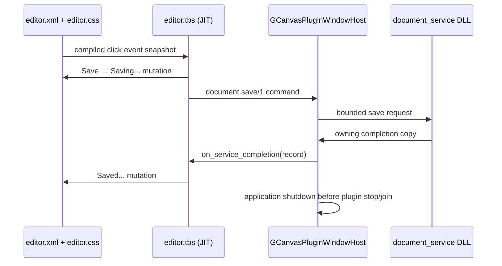

C++ `main.cpp` 只负责读取同目录部署的有界资源、选择交互或 `--smoke` 窗口配置并组合既有 builder；
它不手写 Element tree，不持有 DLL 函数指针，也不重复实现 request routing。`document_service.c` 只公开
版本化纯 C ABI，插件内分配由插件内销毁，request/completion 的 byte view 只在调用期间借用。

`editor.tbs` 是保存交互状态的唯一事实源，只保留 `save_target` 与 `save_in_flight`。脚本最多允许一个
pending save，因此 script request ID 1 只在 terminal completion 释放 gate 后复用；跨请求及跨 reload
身份由 application 生成的单调 `ApplicationRequestToken` 区分。completion 必须同时满足“存在 active
save”与“script request ID 匹配”才能清除 gate，mismatched 或 duplicate completion 直接失败且不产生
部分 mutation。`test_desktop_editor_controller` 直接加载发布的 `editor.tbs`，用 JIT adapter 覆盖重复点击、
失败后恢复、成功、mismatched 和 duplicate completion，避免示例脚本与测试副本漂移。

构建目录把 XML/CSS/TBS 部署到可执行文件旁的 `desktop_editor_assets/`，DLL 与可执行文件同目录；
install 规则保持相同相对布局，二进制中不写入源码树或本机绝对路径。CTest 的 hidden OpenGL
`--smoke` 模式执行真实 click → JIT → DLL → completion → UI mutation 链路，并以固定 pump 上限
验证不会把缺失 completion 隐藏成无限等待。当前 install-tree 运行验证仍需独立发布 preset 覆盖。

## 10. 状态所有权

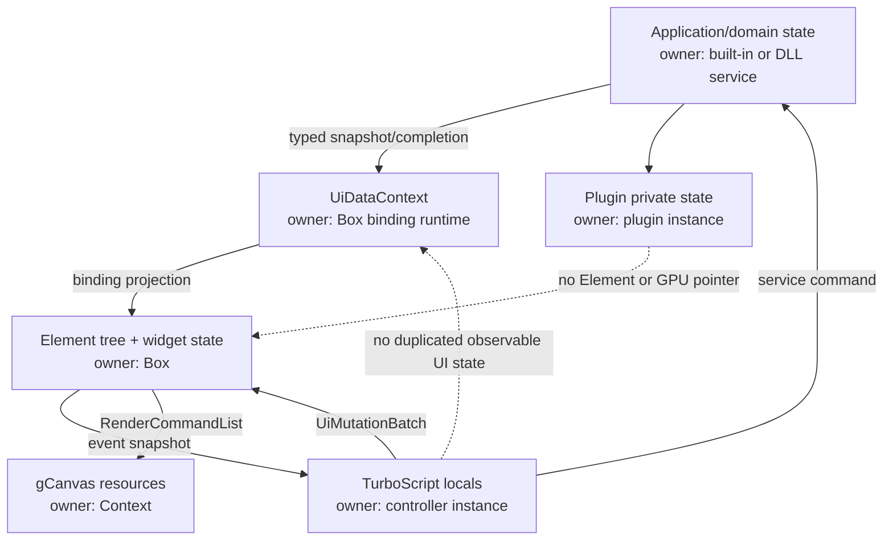

状态约束：

- Element tree 是结构、交互和最终 computed view 的事实源。
- `UiDataContext` 是 binding 可观察输入的事实源；controller 中影响 UI 的长期状态必须写回它。
- application/domain state 归 service；UI 只持有 snapshot 或版本，不维护双向镜像。
- plugin private state 只能由对应 plugin instance 修改。
- mutation batch 和 completion queue 是状态迁移载体，不是第二份业务事实源。

## 11. 装载事务

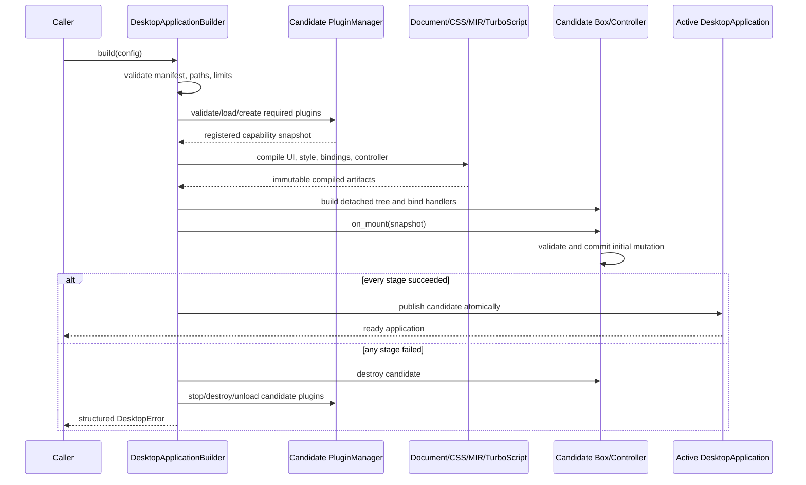

热重载以后复用同一候选构建协议：新文档、脚本或插件未完整通过验证前，活动窗口继续使用旧实例。

当前已实现该协议的 UI application 子集：`DesktopApplicationBuilder` 默认从 `xml_entry()` 构建，
按 XML semantic compile → strict CSS → typed widget instantiate → script module → required export
resolution → controller mount 的顺序生成 detached candidate。成功后才发布；`reload()` 使用一次
`unique_ptr` 交换替换 Box/program/controller，失败保持旧实例。应用及其所有访问限定在调用
`build()` 的 owner thread，跨线程 reload/event dispatch 返回 `WrongThread`。renderer 由调用方借用
并必须比应用存活更久。`dispatch_event()` 已通过独立 framework observer 连接 EventDispatcher 与
controller，不会覆盖现有 C++ global callback。PluginHost 纳入 application transaction 与其余平台
service 仍属于后续阶段。

## 12. 事件、service 与渲染顺序

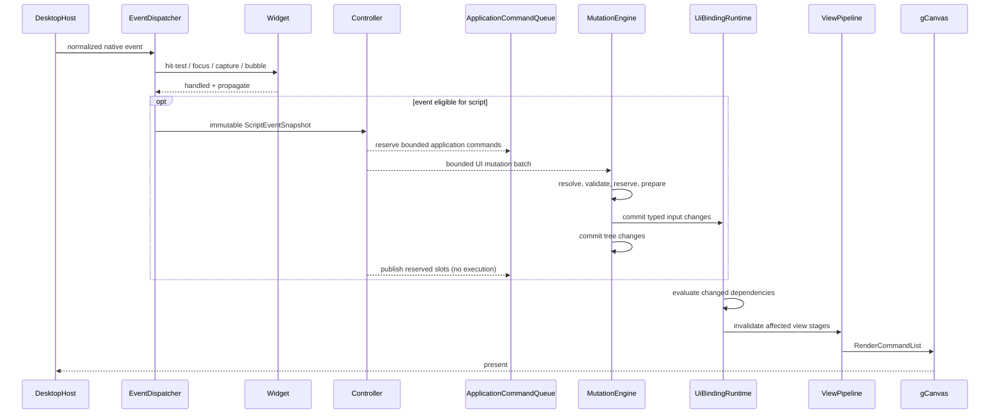

当前契约是 widget → 现有 C++ callback → controller；widget 消费会立即停止当前 route，脚本不接收
该事件。未消费事件按 target→ancestor 冒泡，快照的 `target` 始终表示原始路由目标，
`current_target` 表示当前 binding 所属节点。Click 只在同一 target 完成 MouseDown/MouseUp 且
MouseUp 未被消费时合成，并在原生 MouseUp 冒泡完成后通知脚本。未来若增加 consumed-event 的
post-widget 只读通知，必须先扩展 XML binding schema，不得隐式改变当前默认语义。

## 13. Mutation 与外部副作用

### 13.1 UiMutationBatch

Controller core 当前使用有限 `std::variant`：

- `SetBindingInputNumber/Bool/String`
- `SetText`
- `SetAttribute` / `RemoveAttribute`
- `SetClasses` / `SetUtilities`

`SetValue`、`StartAnimation`、`StopAnimation` 和 `SendTrigger` 要等对应 Box/animation adapter 能提供
相同事务保证后再加入 variant；当前声明不等于真实 Box host 已开放这些脚本操作。

默认 batch 上限为 256 个 mutation、单字符串 16 KiB、所有字符串合计 64 KiB。element ID、属性名、
input 名和值都计入预算。adapter 创建 batch 时可以使用更严格的上限，但不能放宽 host：
`UiMutationEngine` 会用自己的 limits 重新验证。append 或 apply 超限时立即返回明确错误，batch 和 host
均保持不变。

| Mutation | 事实源/target owner | prepare 前置条件 | 错误 | 真实 host final-state staging |
|---|---|---|---|---|
| `SetText` | Box-owned Element | handle 当前有效、text 有界 | `InvalidTarget` / string limit / host error | 旧 text 与已预留新 string |
| `SetAttribute` / `RemoveAttribute` | Box-owned Element | handle 有效、name 非空且类型允许 | `InvalidTarget` / `InvalidName` / host error | 旧 attribute presence/value 与新 map staging |
| `SetClasses` / `SetUtilities` | Box-owned Element | handle 有效、tokens 可由 style/utility 层完整验证 | target/string/host error | 旧 token set、selector/utility dirty staging |
| `SetBindingInputNumber` | Box-owned `UiDataContext` | name 非空、number finite、kind 不冲突 | `InvalidName` / `InvalidNumber` / host error | 旧 typed value、version 与 invalidation staging |
| `SetBindingInputBool/String` | Box-owned `UiDataContext` | name 非空、kind 不冲突、string 有界 | `InvalidName` / string/host error | 旧 typed value、version 与 invalidation staging |

处理阶段：

1. normalize：检查 batch 数量、字符串、数组和嵌套深度上限。
2. resolve：把 `{id, generation}` handle 解析为当前节点，旧 generation 立即失败。
3. prepare：验证类型和 target ownership，预留容器容量，准备新旧值交换记录。
4. commit：通过只允许无失败 swap/赋值的 mutation adapter 提交。
5. discard：prepare 任一阶段失败即由 RAII 丢弃全部 staging；commit 边界只含无失败操作，因此不进入
   需要补偿的半提交状态。

`BoxMutationHost` 是 `FlexUI::Controller` 中依赖 `FlexUI::Core` 的薄适配层。它只接受从 Box root
可达的 application-owned Element；stale、detached、widget-owned target 在 prepare 阶段返回
`InvalidTarget`。同一 Element 的多条命令按 batch 顺序合并到一个 final-state staging。prepare 按需
复制实际触及的字段：`SetText` 不复制 selector/attribute 状态，attribute mutation 不复制 class sets。
classes/utilities 在 staging 中完成 token 解析、catalog 校验和 selector state 重建。commit 只 swap 已准备
的 string/map/set，设置 dirty flags，不分配、不解析，也不调用可能分配的公开 setter。未 commit 的
staging 由 RAII 丢弃；commit 为幂等 `noexcept` 操作。

Binding input mutation 只更新调用方预先声明且类型固定的 input，不允许脚本隐式创建或改变 input
schema。prepare 验证 name 存在、number/bool/string 类型吻合并检查 revision 不溢出；commit 仅更新
现有 map entry。UI element staging 与 input staging 全部验证完成后才生成 prepared transaction，任一
错误不会留下部分状态。

`Box::elements_by_id_` 的索引条目同时持有 Element pointer 与 generation，是句柄状态的唯一事实源；
Controller 不维护镜像 registry。创建带 ID 元素、ID 改名、重复 ID 覆盖、旧 owner 恢复和 ID 复用都会
取得新的 Box-wide 单调 generation，因此旧句柄不会因相同字符串 ID 再次出现而复活。空 ID、被重复
ID 遮蔽的元素和其他 Box 的元素不能生成有效句柄。UI document 的 detached build 使用 candidate index
和 candidate generation，只有完整安装成功才一起提交；binding 安装失败会同时恢复 index 与 generation
counter。

句柄有效只表示“该 ID 当前仍指向同一个 Box index incarnation”，不表示节点当前可从 root 到达。
`UiKeyedRepeater` 的 retired 节点仍由 Box 保留，直到 Box 提供通用 subtree destruction 前不会仅因 detach
自动失效。真实 mutation host 的 resolve/prepare 阶段仍必须按 mutation 类型验证 active-tree、widget/
application ownership 和 target kind；未来 subtree destruction 必须在释放内存前删除索引条目，使句柄
立即 stale。

`IUiMutationHost` 定义 host 事务边界，并由 fake host 与真实 `BoxMutationHost` 共同验证：`prepare()`
不可改变可观察状态，返回的 `IPreparedUiMutation` 独占所有 staging 且不得保留 batch view；未 commit
的 staging 随 RAII 析构丢弃，`commit()` 必须幂等、`noexcept` 且不分配。TurboScript adapter 仍需
完成自己的 value conversion 和 resource limits 后才可暴露这些 mutation。

### 13.2 ApplicationCommand

文件、网络、数据库或设备操作不是 UiMutation。`ScriptCallResult` 分别拥有 `UiMutationBatch` 和
`ApplicationCommandBatch`。command 是 `{request_id, capability, operation, payload}` envelope；payload
是 adapter 定义 schema 的自有序列化字节，不把 service/plugin 类型扩散到 controller core。默认上限为
64 条、单字符串 16 KiB、全部字符串 64 KiB，controller 侧 `ApplicationCommandEngine` 会再次验证
request ID、capability、operation 与 limits。

1. `IApplicationCommandQueue::reserve()` 校验 capability、参数 schema 和 queue 容量，将 batch 复制到
   queue-owned slot，但不向 consumer 暴露。
2. reserve 失败时不 prepare UI mutation；UI mutation 失败时 reservation 由 RAII 析构释放。
3. UI mutation 成功后才调用 reservation 的 `publish()`；publish 必须幂等、`noexcept`、不分配、
   不阻塞且不执行 command。
4. service 在 controller 返回后同步接受已发布 command，耗时工作可进入其 worker。
5. 完成结果通过有界 UI completion queue 返回，再生成新的 controller event。

外部副作用无法与 UI 内存状态做通用回滚，因此不允许 DLL 在 controller callback 栈内直接执行
不可回滚操作。`on_mount` 在 candidate application 发布前执行，因此当前 fail fast 拒绝 command；
`on_unmount` 同样禁止 UI mutation 和 command。未来若 DesktopApplication 提供更外层 activation
transaction，可通过另一个延迟 publication adapter 扩展 mount 语义，不能静默改变现有顺序。

### 13.3 ApplicationCompletionMailbox

当前 C++ host 边界已经提供 `ApplicationCompletionMailbox`；DLL C ABI 已冻结并由 PluginHost 把 ABI
completion 转为 owning `ApplicationCompletion`，application owner 可再把恢复 script request ID 后的
completion 转为 TurboScript controller event。其协议如下：

| 项目 | 契约 |
|---|---|
| 数据单元 | Disruptor 固定槽位只保存一个 host-owned `ApplicationCompletion*`；实际 record 拥有 token、status、payload、error code/message |
| 事实源 | publish 成功至 receive/cancel 之间，mailbox slot 指向的 record 是 completion 唯一事实源；statistics 只是原子派生计数 |
| 所有权 | `try_post(const ApplicationCompletion&)` 在 host 内复制完整 record；成功后 queue 独占副本，失败时调用方对象不变；`try_receive()` 将独占值移交 UI owner |
| 生命周期 | record 在 receive、close、generation advance 或 mailbox destruction 时释放；DLL 输入 buffer 只借用到未来 C adapter 的 `post_completion()` 返回 |
| 拓扑 | 多个 service worker producer、一个 application owner-thread consumer；单 consumer 按全局 publish sequence FIFO 领取 |
| 容量 | 默认 256 个 pointer slot，配置必须是非零 2 的幂；默认 payload 64 KiB、error code 256 B、error message 16 KiB、字符串总量 64 KiB |
| 背压 | `try_post()` 不因容量阻塞；满时返回 `QueueFull`，不扩容、不覆盖、不丢弃、不 fallback |
| 唤醒 | 可在构建时注入 borrowed `noexcept` 函数指针与 opaque context；只在 publish 成功后调用一次，不携带数据，拒绝路径不调用 |
| 失败 | 区分 invalid capacity/generation/token/status、string limit、allocation、full、closed、stale generation、wrong thread 和 internal invariant |
| 关闭 | owner 先停止接受新 post，等待已进入的非阻塞 producer（包含其 wakeup callback）离开，再取消并释放所有已发布 record；重复 close 成功且取消数为零 |
| 观测 | 暴露 current/peak depth、published、consumed、cancelled、queue-full、closed/stale/invalid rejection 计数 |

`ApplicationRequestToken` 是 `{host_request_id, application_generation}`，两部分都必须非零。script 自己的
`request_id` 不直接充当跨 reload 身份；`DesktopApplication` 在 command reservation 时生成 host token，
并由 application-owned request table 保存 token 到 script request ID 的有界 pending 映射。mailbox 只验证
token 是否属于当前 generation，不维护第二份业务请求状态。

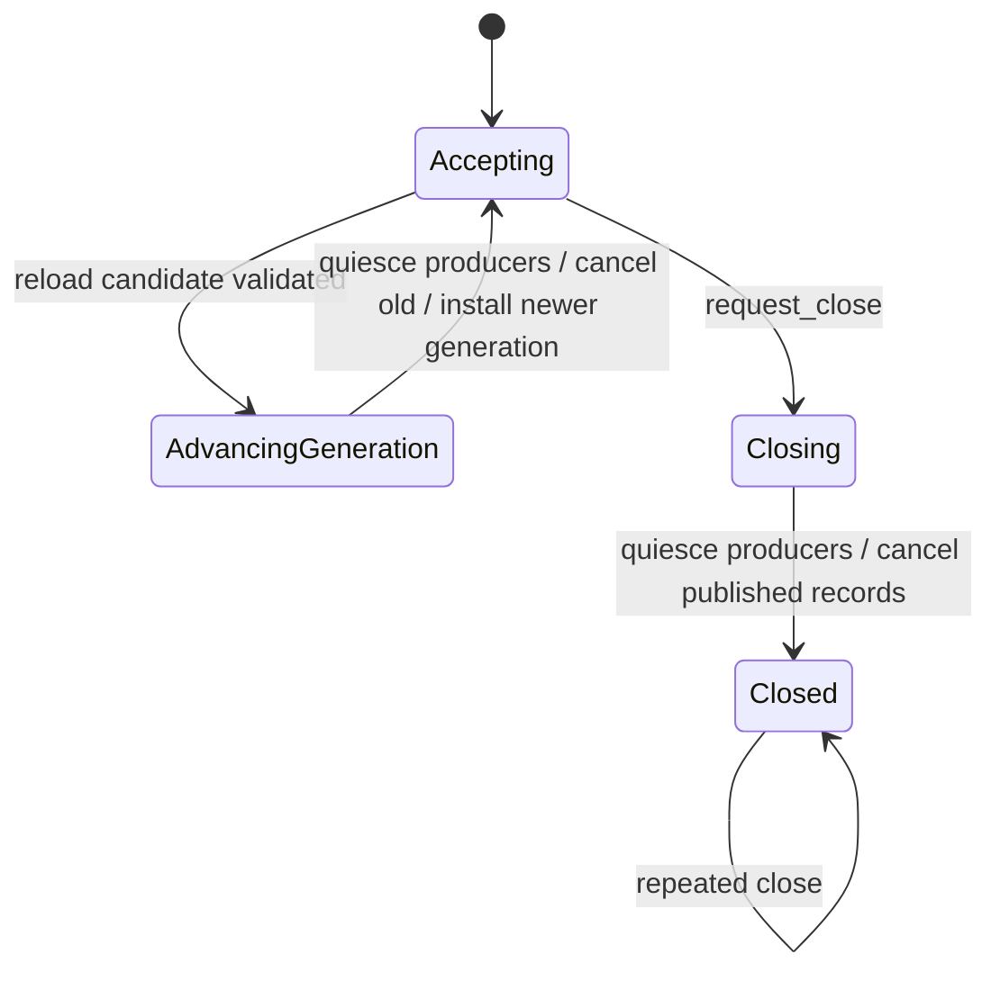

`DesktopApplication` 在成功 build 时创建 generation 1 的 mailbox 和 request table。reload 先构建完整
detached candidate，再检查 generation 溢出，依次淘汰旧 completion、取消旧 pending request，最后以无失败
pointer swap 发布新 controller；candidate 失败时 generation 与旧队列都不变。`request_close()` 在发布
`CloseRequested` 前先关闭并取消 request table，再同步完成 mailbox close，因此并发 worker 最终只会得到
success、`QueueFull` 或 `Closed`，不会把 completion 投递给已关闭 controller。mailbox 析构本身会再次
quiesce/drain，但对象生命周期不能保护已悬空的调用方指针；PluginHost 仍必须在销毁 application/mailbox
前停止并 join 所有 worker。

### 13.4 ApplicationServiceRequestTable

`ApplicationServiceRequestQueue` 是 controller command 与 host service dispatcher 之间的私有桥接层；
公开边界只暴露 owning value 和结构化 poll result，不把 slot、队列或 controller 指针交给 worker。

| 项目 | 契约 |
|---|---|
| 数据单元 | host-facing request 拥有 token、script request ID、capability、operation 和 payload；pending slot 在 dispatch 后只保留 token/script identity |
| 事实源 | 固定 slot table 是 `{host token -> script request ID}` 的唯一 pending 事实源；queue 持有的 immutable registry + manifest 是授权与 endpoint routing 的唯一事实源；mailbox、statistics 与 host request copy 都不独立推进状态 |
| 所有权 | application owner thread 独占 table；`try_receive_service_request()` 把字符串所有权移交 host；worker 只能把同一 token 放入 owning completion 并调用 mailbox `try_post()` |
| 生命周期 | `Free -> Reserved -> Published -> InFlight -> Free`；未 publish 的 RAII reservation 回到 Free，completion 只允许解析一次 |
| 拓扑 | 单 owner producer/consumer 管理 request table；多个 worker 只生产 completion。request 按 command publication 全局 FIFO，completion 可乱序 |
| 容量 | 默认 256；固定容量同时统计 Reserved、Published 和 InFlight，构建后不扩容 |
| 校验与背压 | reserve 在 slot 分配和 UI mutation prepare/commit 前校验完整 batch 的 capability 授权、service、operation 与 payload limit；失败返回既有 command error。容量满时返回 `QueueFull`，不修改 UI、不发布部分 request、不阻塞或 fallback |
| 身份 | script request ID 在 pending 期间唯一；host token ID 非零且进程内单调递增，generation 在成功 reload 时递增，discard 可留下不可复用的 token gap |
| 失败 | 区分 invalid capacity/generation/request、duplicate ID、full、unknown token、premature/duplicate completion、closed、wrong thread、allocation 和 mailbox failure |
| 关闭/reload | reload 取消旧 generation 的 Reserved/Published/InFlight slot；close 先拒绝并取消 request，再关闭 mailbox；两者都不向新 controller 传递旧 completion |
| 观测 | 暴露 current/peak pending、published、dispatched、completed、cancelled、discarded、queue-full、duplicate/unknown rejection 计数 |

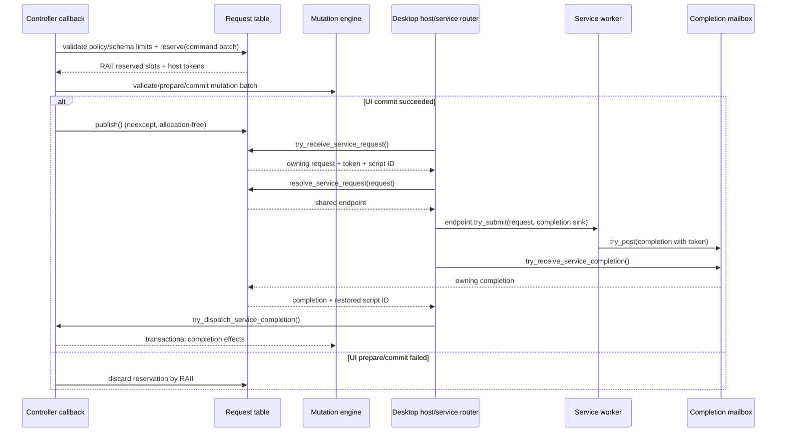

当前桥接已完成到 controller：host 可以取得 service request，通过不可变 registry 做 capability、
operation 与 payload limit 校验并解析 C++ endpoint，再把 worker completion 恢复为原始 script request ID；
application owner 可选择 raw poll，或调用 `try_dispatch_service_completion()` 进入脚本事务。DLL C ABI 与
PluginHost stop/join 已完成。`ApplicationServiceDispatcher` 现提供不依赖 PluginHost/window 的 owner-thread
自动路由：每次 pump 有界取得 FIFO request、重复解析 endpoint 并调用 `try_submit()`；endpoint 接受后拥有
唯一 completion 尝试，拒绝或抛异常则转换成一个稳定错误码的 failed completion，不选择 fallback。若
mailbox 已满，dispatcher 最多保留一个待投递 terminal completion，在投递成功前不再消费 request。
gCanvas host 为每个 application 创建一个 dispatcher；直接使用 `DesktopApplication` 的调用方仍可选择
raw request polling。typed payload schema、把 PluginHost 生命周期纳入 DesktopApplication transaction
仍是后续边界；当前仍仅允许 host 明确加载可信 DLL。

生命周期回归还覆盖独立 static-CRT test DLL：插件以 `/MTd`/`/MT` 构建，host 以 `/MDd`/`/MD`
构建，只通过 borrowed byte views 和 caller-owned error buffer 通信。测试在 `submit()` 返回后修改 caller
payload，异步 completion 仍取得插件已复制的原值；create/start/stop failure、retryable stop、重复 stop、
host 释放后 cached endpoint 返回 `Closed`，共同约束 destroy/unload 只能发生一次且不得再调用 DLL 代码。

### 13.5 Service completion controller event

`ScriptController::load()` 与其他生命周期 export 一起解析可选的 `on_service_completion`，并缓存稳定
handle；steady dispatch 不按名称查找。该 export 必须接收一个 record：

```text
{
  request_id: int64 > 0,
  status: "succeeded" | "failed" | "cancelled",
  payload: string,
  error_code: string,
  error_message: string
}
```

record 只在同步 `IScriptModule::call()` 期间借用 owning `ApplicationServiceCompletion` 的 explicit-length
string view，adapter 不得保存。controller 重新检查 request ID、status invariant、单字段与字符串总量；
TurboScript adapter 还拒绝超过 int64 的 request ID。successful completion 不带 error 字段，failed 必须
带非空 error code，cancelled 不带 payload/error code；service failure 是业务数据，不会自动 fallback。

`try_dispatch_service_completion()` 每次最多消费一个 completion，且必须由 application owner thread
调用。若 controller 或 optional export 不存在，返回 owning completion 且 `dispatched=false`，由 host
显式处理；若 handler 存在，则其 mutation/command result 仍遵循 command reserve → mutation prepare/
commit → allocation-free publish。handler/adapter 失败会消费当前 completion、fault controller 并返回嵌套
`DesktopApplicationError`，不得重试或重入另一种处理路径。

raw `try_receive_service_completion()` 与 scripted dispatch 共享唯一 mailbox consumer，同一 application
不得混用。reload 的 generation advance 会先淘汰旧 completion，close 会在状态发布前关闭 mailbox，因此
旧/关闭 completion 不会到达替换或关闭后的 controller。`GCanvasWindowHost` 在 application build 时注入
allocation-free wakeup：worker 成功 publish 后调用 `Window::trigger_events()`，使 `wait_events()` 返回；
通知不携带 completion，也不替代 mailbox polling。通知允许冗余，因为 mailbox 仍是唯一事实源。

每个 host pump 在 `on_frame` 前最多 dispatch `max_service_completions_per_pump` 条，默认 64、合法范围
1..4096；达到上限后再次投递空事件，下一轮继续处理，不 busy-spin。controller 没有
`on_service_completion` 时 host 不消费 record，raw polling 契约保持不变。handler 失败会消费该 record，
映射为 `ServiceCompletionFailed`/`ServiceCompletion`，并沿 host 的 primary-error 路径请求关闭和 shutdown，
不会重试或切换 raw fallback。

## 14. DesktopHost 与 gCanvas

`IDesktopHost` 负责：

- window lifecycle、尺寸、DPI、显示器和 redraw scheduling。
- mouse、keyboard、text input、IME composition、clipboard 和 cursor。
- native dialog、drag/drop、timer 和 UI-thread task posting。
- 创建并保持 gCanvas 所需的 OpenGL context/native callbacks。

gCanvas 负责：

- GPU Context、frame lifecycle、font/image/path resource 和 draw submission。
- OpenGL/Vulkan backend 差异。
- 严格的单线程 Context 和 GPU resource 生命周期。

当前已经完成与真实窗口解耦的应用输入边界：`GCanvasInputNormalizer` 是 native value 转换和
最后有效 pointer position 的唯一 owner；`GCanvasApplicationInputRouter` 借用一个
`DesktopApplication`，在触碰 normalizer 或 Box 前检查 application owner thread，再把 mouse、wheel、
key 和 text 路由到 `dispatch_event()`，或把正数 logical resize 写入 viewport 并 invalidate。转换失败
保留 `GCanvasInputError`，应用失败保留完整 `DesktopApplicationError`；无可编辑焦点的合法字符输入
返回 success/not-processed，而不是伪造派发。focus gain 不改变 Box；focus loss 在 owner thread 清除
focused element 与内部 mouse capture。该边界只依赖 `gCanvas::Core` event contract，不创建窗口、context
或 frame。

`FlexUI::GCanvasWindowHost` 现已组合可选 `gCanvas::Window`，复用其 GLFW helper；该 target 位于
desktop adapter 层并公开依赖 `gCanvas::Window`，`FlexUI::Core` 不链接 GLFW。IME、clipboard、dialog
等尚缺能力继续由 DesktopHost 的平台 service 补齐。长期 native/SDL host 可通过相同 Bridge 使用
gCanvas HostManaged/External Context，不修改 FlexUI Core。

当应用同时启用 DLL service 时，`FlexUI::GCanvasPluginWindowHost` 是额外的可选生命周期 Facade：

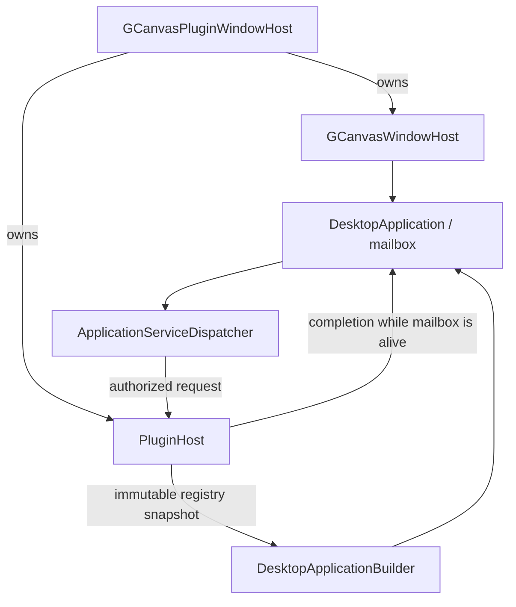

该 target 不替代两个独立 target。只用 built-in service 的程序继续直接创建 `GCanvasWindowHost`；无窗口的
服务程序继续独立持有 `PluginHost`。选择组合层的调用方把完整 plugin build result move 给 `create()`，
之后不再手工注入另一份 registry 或自行决定相反的销毁顺序。

Host 的所有权与销毁依赖固定为 `Window -> Context(borrowed) -> Flex renderer -> DesktopApplication ->
ApplicationServiceDispatcher -> input router -> listener subscriptions`，RAII 逆序先移除 scoped callback，
再销毁 dispatcher/application/renderer，
最后由 Window 销毁 GPU Context 与 native window。旧 `add_*` 和全局 `reset_listener()` 仅保留兼容
用途，Host 只使用 move-only `WindowListenerSubscription`。Windows native pointer capture 仍由
`gCanvas::Window` 独占平台实现；Host 在 pointer event 与 frame 后把 Box internal capture 同步到 native
capture，close/focus loss 则清理 Box focus/capture 并释放 native capture。其他平台明确报告不支持，
不以 cursor confinement 偷换语义。

默认 backend 仍为 OpenGL；调用方也可显式选择 Vulkan。Window、Context、renderer、application 或
listener 任一构建阶段失败都返回带 stage/cause 的错误并按 RAII 回收已构建候选，不自动在 OpenGL
和 Vulkan 之间切换。

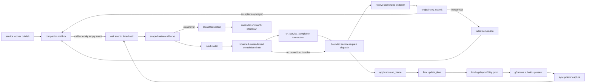

`EventDriven` 在无事件时使用 `wait_events()`，适合静态窗口；`Continuous` 使用有界 timed wait 驱动
动画/主动刷新，避免 busy polling。`run()` 根据 steady clock 计算 delta 并上限裁剪；显式
`pump_once(delta)` 对非有限、负数或超过配置上限的 delta fail fast。每轮都执行 binding/update，
但 RenderManager 只在 dirty 时提交绘制；无 `on_frame` 时 controller 不产生 frame 脚本调用。completion
wakeup 可从任意 worker thread 触发，实际 mailbox consume、controller call 和 UI mutation 仍只发生在
owner thread。达到 drain 上限时 host 再投递一个空事件，避免剩余 record 因重新进入 wait 而滞留。
随后 host 通过 `ApplicationServiceDispatcher` 提交最多 `max_service_requests_per_pump` 条 request（默认
64，合法范围 1..4096），再调用 `on_frame`。达到 request 上限或 terminal completion 因 mailbox 满而
Blocked 时同样投递空事件。同步 endpoint 本轮产生的 completion 在下一轮 completion stage 消费，确保
每轮固定遵循 completion → request → frame，且两个方向的 burst 都不能无限占用 UI thread。

GLFW C callback 是严格的异常边界：坐标换算、metrics 同步或 listener 派发产生的首个异常由对应
`Window` 保存，同一轮后续 native callback 不再推进状态，并在 `poll_events()`、`wait_events()` 或
触发同步 callback 的 window 操作返回到 C++ 后重新抛出。这样异常不会跨越 GLFW C ABI，Host 仍在
统一的 native-event 消费边界转换为结构化错误并进入关闭流程。

窗口 logical size、GPU framebuffer extent 与平台 content scale 已在 gCanvas Window 内分流。对非空
target，逻辑尺寸为 `round(framebuffer / effective content scale)`；GLFW cursor 通过
`logical extent / window screen extent` 映射，因此既不假定 screen coordinates 就是像素，也不在所有
平台固定除以 DPI。`Window::set_size()` 使用同一已观测比例的逆变换。`native_pixel_size=true` 时 effective
scale 为 1，逻辑尺寸直接等于 framebuffer 像素尺寸。Window size、framebuffer size 与 content-scale
callback 更新同一 metrics 状态；FlexUI resize/pointer 只接收 logical coordinates，只有 physical extent
进入 OpenGL viewport 或 Vulkan swapchain。`CanvasMetrics` 更新不再覆盖 Context physical extent。

任一 framebuffer 维度为零表示暂时不可呈现：backend 保留最后一个非空 logical viewport，丢弃该帧的
draw queue 与 transient path resource，不 present、不积累待恢复后回放的旧命令；负 framebuffer extent
直接拒绝。平台原生最小窗口尺寸仍可钳制 `set_size()` 请求，回调发布的是实际 logical size。

## 15. 线程与关闭协议

`DesktopApplication` 是 application lifecycle 的唯一事实源：

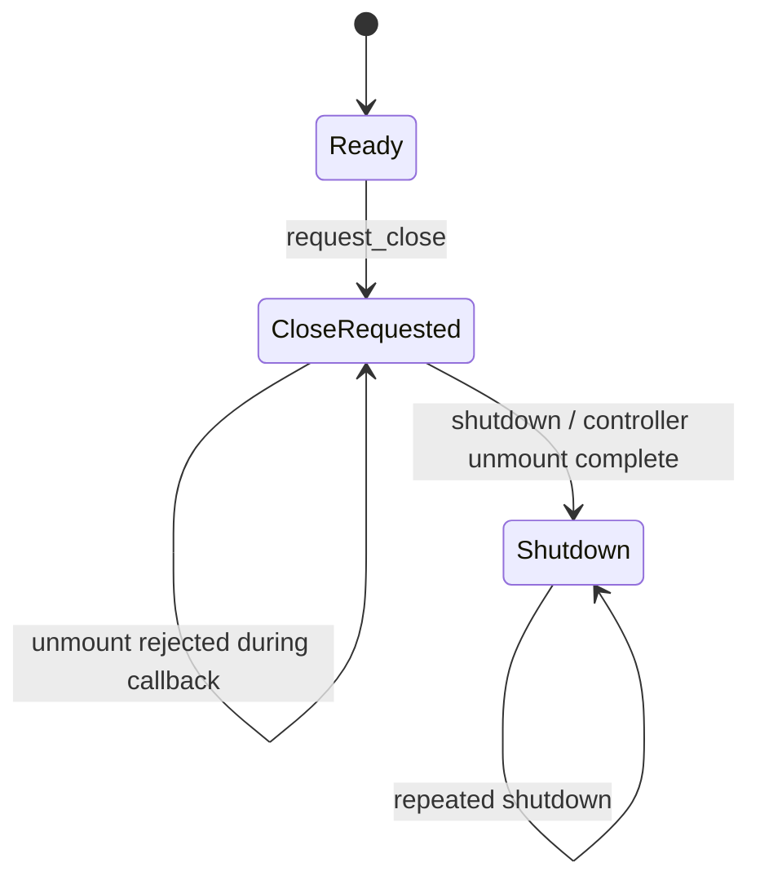

只有 owner thread 可以推进状态。`CloseRequested` 起拒绝新的 event dispatch、frame 与 reload；Box、compiled
program 和 source snapshot 仍可读取。`shutdown()` 只在 `CloseRequested` 执行 controller unmount：
若 `on_unmount` 报错但 controller 已完成清理，application 进入 `Shutdown` 并向宿主保留 nested error；
若 callback 正在执行而 unmount 被拒绝，则保持 `CloseRequested`，宿主可在 callback 返回后重试。
`Shutdown` 不提前销毁 published state，实际对象销毁仍由 RAII 完成。

- UI thread 独占 DesktopHost、Box、EventDispatcher、ScriptController 和 gCanvas Context。
- `GCanvasWindowHost::run()` / `pump_once()` 是 frame 与 shutdown 的唯一推进边界；native close callback
  只请求 close，不在 GLFW callback 栈内执行 controller unmount。
- TurboScript callback 只在 UI thread 运行。
- 插件 lifecycle callback 默认在 UI thread；耗时任务由插件提交到明确的 worker service。
- worker 不能调用 UI API，只能向 application-owned 有界 completion mailbox 发布值语义消息；只有
  application owner thread 可以 receive、advance generation 或 close。
- completion wakeup callback 与 context 由 builder 借用，必须比 application 和全部 producer 存活更久；
  `request_close()` 通过 mailbox quiescence 保证返回前没有 callback 仍在执行。
- 组合关闭顺序：停止新事件并关闭 request/mailbox → controller unmount，使 application 进入
  `Shutdown` → PluginHost 逆序 stop/join → destroy PluginHost/卸载 DLL → destroy application/Box/
  controller → 等待 GPU idle 并销毁 Context → destroy native window。
- `GCanvasPluginWindowHost::shutdown(timeout)` 只接受非负 timeout。`JoinTimedOut`、`StopFailed` 或
  `JoinFailed` 保留原始 `PluginHostError`，composition、application 和 PluginHost 都保持存活；owner
  thread 可以再次调用 `shutdown()`。只有 plugin join 成功后才允许后续 RAII 释放 mailbox。
- `request_close()` 只推进窗口/application close，不等待 worker；`pump_once()`/`run()` 观察到
  application `Shutdown` 后才使用构造时 timeout 自动 stop。析构路径使用无限 join 安全网，避免强制
  unload 仍在执行的插件代码。
- DLL 在函数调用、callback、worker 或 borrowed buffer 尚存活时不得卸载。

## 16. 错误语义

统一 `DesktopError` 至少携带：

- stage：Config、PluginDiscovery、PluginAbi、DocumentParse、DocumentSemantic、StyleCompile、
  BindingCompile、ScriptCompile、HandlerResolution、Mount、Callback、Mutation、Service、GPU。
- code、message、source path、line/column、element ID、handler/service/plugin name。
- cause chain 中的外部库错误码，但不暴露第三方对象生命周期。

错误策略：

- required plugin/capability、controller、document、style 或 GPU 初始化失败：应用构建失败。
- optional plugin 缺失：仅当 manifest 显式 optional 时允许继续，capability 查询明确返回 unavailable。
- controller callback 错误或超时：丢弃未提交 batch，controller 进入 Faulted，显式 reload 才恢复。
- service command 失败：产生类型化 completion error，不伪装成成功，也不自动改用其他 service。
- service completion handler 失败：fault controller，host 保留嵌套 application/controller cause，随后
  进入受控 shutdown；当前 record 不重试且不回退 raw consumer。
- GPU/backend 不可用：构建失败，不自动从 OpenGL 切换 Vulkan 或反向切换。
- 错误只在被宿主消费的边界记录一次，避免 parser、adapter、controller 重复打印同一原因。

## 17. 性能与资源边界

- parse、CSS compile、MIR compile、TurboScript compile 和 handler resolution 都在 load/reload 完成。
- event callback 使用 interned symbol、连续 snapshot 和有界 batch，不逐帧扫描 Element tree。
- 无 `on_frame` export 时每帧脚本调用数为零。
- DLL service 以 command/batch 粒度调用，不在每个 Element 或 draw command 上跨 ABI。
- 可增长结构必须由 application limits 配置容量：plugin count、service count、declared resources、event bindings、
  mutation commands、completion queue、script values、controller memory 和 GPU resources。
- 渲染保持 RenderCommandList 路径；controller 和 plugin 不进入 paint replay。

性能验收必须记录：

- cold load：manifest、plugin、document、CSS、MIR、TurboScript、首帧分项耗时。
- steady event：controller call、mutation prepare/commit、binding、layout、paint 分项延迟。
- idle frame：无动画无事件时 CPU 占用和 callback 数。
- memory：基础应用、每 1000 nodes、每 plugin、script context 和 GPU resource 峰值。
- stress：大量 binding、事件 burst、completion queue 饱和、窗口 resize 和 DPI 切换。

具体门槛在 benchmark 基线建立后冻结，不能凭理论值宣称优于 Electron、WebView 或 Qt。

## 18. CMake 与部署

计划 targets：

```text
FlexUI::Core
FlexUI::Document
FlexUI::TailwindCSS
FlexUI::Controller
FlexUI::ControllerTurboScript
FlexUI::PluginHost
FlexUI::GCanvasWindowHost
FlexUI::GCanvasPluginWindowHost
FlexUI::Desktop
```

规则：

- `FLEXUI_ENABLE_TURBOSCRIPT` 控制 adapter；启用时使用
  `find_package(TurboScript CONFIG REQUIRED)`。
- `FLEXUI_ENABLE_PLUGINS` 控制 DLL host；关闭时不编译 loader，静态应用行为不变。
- `FlexUI::GCanvasPluginWindowHost` 只在 `FlexUI::PluginHost` 与 `FlexUI::GCanvasWindowHost` 两个 target
  都存在时生成；关闭插件不能改变独立 gCanvas host 的 target graph。
- `FlexUI::Desktop` 私有链接平台 window adapter；FlexUI 公共文档/状态类型不包含 GLFW/Win32。
- DLL 使用单独 SDK target，只导出稳定 C header 和 import definitions。
- Debug/Release runtime、CRT、calling convention、visibility 和 struct packing 都进入 ABI compatibility test。
- 应用部署包含可执行文件、TurboScript runtime、所选 gCanvas backend、plugin manifests/DLL 和 assets；
  不包含源码树绝对路径。

## 19. 兼容性、迁移与回滚

### 19.1 兼容性风险

- 新增 `bind.*` 会扩展 Flex DSL 保留 property 语义，但不应改变其他 attribute 的解析。
- `on.*` 从 metadata 升级为类型化 handler 后，未知 handler 将由“点击后无行为”变为 load error；
  这是有意的 fail-fast 用户可见变化，需提供诊断和迁移说明。
- controller 插入事件链可能改变 handled/propagate 顺序，必须先冻结事件契约。
- TurboScript 和 plugin targets 增加部署文件、ABI 和许可检查。
- DesktopHost 替换示例 GLFW glue 后可能改变 DPI、键值和 text input normalization。

### 19.2 迁移路径

1. 新增 `CompiledUiProgram`，保留 `parse_ui_document` 和 `UiDocumentInstantiator`。
2. `on.*` 生成唯一 handler table，并由该表投影可变兼容 attribute；attribute 修改不反写事件表。
3. controller 先接 fake module，不改变默认 Box 事件路径。
4. TurboScript adapter 由显式 feature 和 application builder 启用。
5. DLL plugin host 先独立测试，再向 controller service bridge 注册 capability。
6. 同时使用 gCanvas 与 DLL service 的 host 可迁移到 `GCanvasPluginWindowHost`，移除手工 registry 注入和
   PluginHost 销毁排序；两个独立 target 保持兼容。
7. DesktopApplication 示例与现有手写 Box 示例并存，稳定后再迁移主示例。

### 19.3 回滚

- 关闭 TurboScript/plugin feature，回到现有 C++ callback、binding 和 animation 路径。
- 不创建 DesktopApplication 时，Box 公开行为不变。
- controller 创建失败不会接管 EventDispatcher callback。
- plugin load/start 失败时按相反顺序销毁已成功创建的候选插件，活动应用不变。
- OpenGL backend 独立于 controller/plugin；脚本或 DLL 回滚不改变 renderer contract。

## 20. 风险审查

| 等级 | 证据类型 | 风险与影响 | 控制措施 |
|---|---|---|---|
| HIGH | 事实 | 多个仓库消费者仍加载 legacy `.flex`，现在删除 compiler 会破坏工具和示例 | 先迁移消费者并完成 install-tree 回归，再移除兼容 frontend |
| HIGH | 推论 | DLL 可破坏宿主进程内存，无法在同进程可靠恢复 | 首版只加载可信插件；不可信插件以后进程隔离 |
| HIGH | 事实 | 当前 Event 包含裸 `Element* target`，不能直接复制到脚本/DLL | 构造值语义 snapshot，只含 handle 和有限字段 |
| HIGH | 推论 | mutation 与外部副作用混合会产生不可回滚状态 | 分离 UiMutation 与 ApplicationCommand，先 reserve 再发布 |
| MED | 事实 | handler export 已在 load 时解析，但 EventDispatcher 尚未自动生成 script snapshot | P6 冻结 widget consumption/bubble 语义后接入单一事件桥 |
| MED | 推论 | XML 与 legacy frontend 若形成两套 runtime 会扩大迁移和测试成本 | 两者只输出同一个 compiled program；legacy 设定移除门槛 |
| MED | 事实 | gCanvas Context 单线程且 host/window 有明确销毁顺序 | DesktopHost 固化 UI-thread 和 shutdown protocol |
| MED | 推论 | 热重载 DLL 容易遗留函数指针和 worker | 首版不启用；后续需引用清零、状态迁移和原子路由 |
| LOW | 推论 | `.tbs` handler 字符串易产生拼写错误 | load-time export resolution 和 source-located error |

## 21. 架构验收条件

设计落地后必须满足：

- 不含 controller/plugin 的现有 FlexUI tests 和 command snapshots 行为不变。
- application load 任一阶段失败都不发布 window/Box/controller/plugin 半状态。
- handler 在 load 阶段解析；不存在的 required handler 给出源位置。
- callback 错误、超时、stale handle 或超额 batch 不提交部分 UI 状态。
- DLL ABI 在独立 MSVC Debug/Release consumer 中完成 load/call/stop/unload 测试。
- plugin 无法从 public ABI 获得 Element、Renderer、gCanvas Context 或跨模块 C++ container。
- UI thread、worker completion、shutdown 和 window close 的测试无悬空 callback。
- 无脚本、无 plugin、无动画窗口不产生脚本/plugin frame callback。
- OpenGL GPU smoke、resize、DPI、text input、IME、clipboard 和 focus 回归通过。
- benchmark 给出可复算基线，不用未经测量的“快于 Electron/Qt”作为完成结论。

