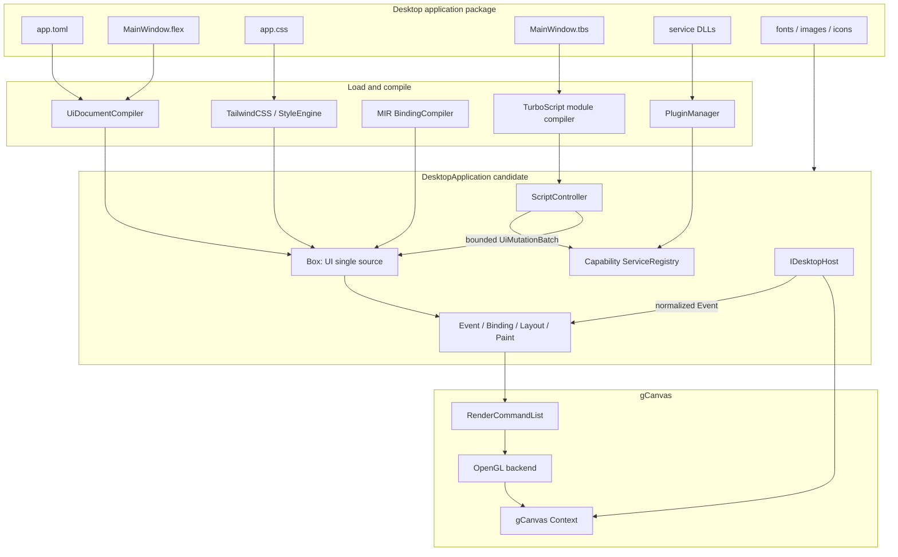
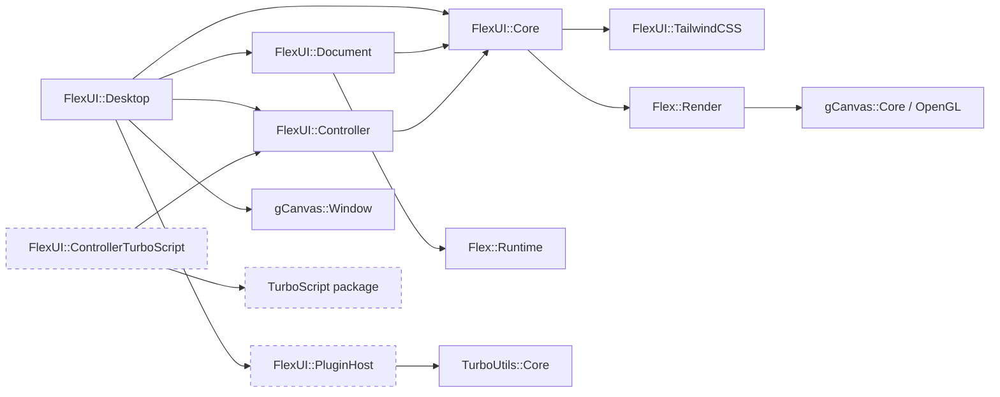
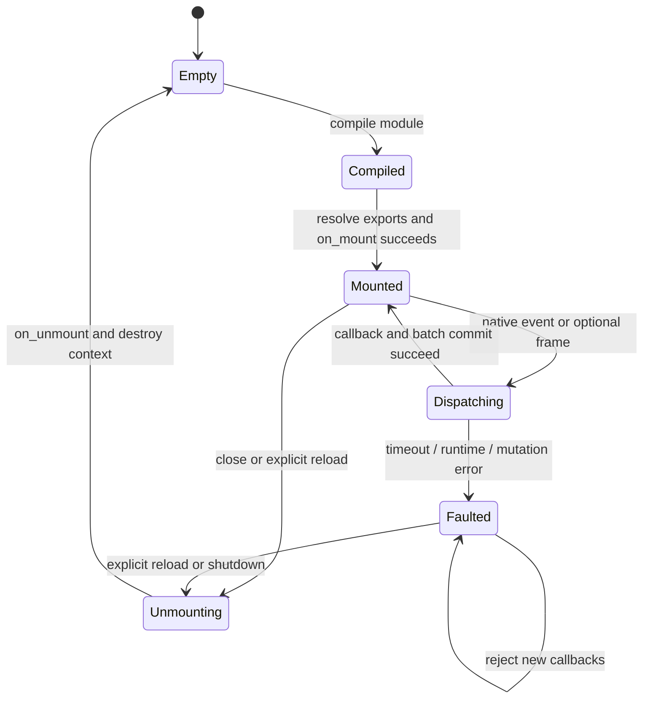
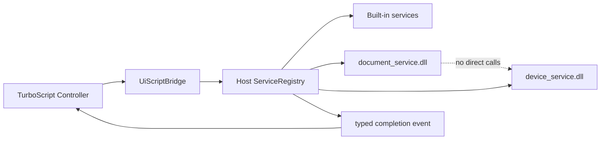
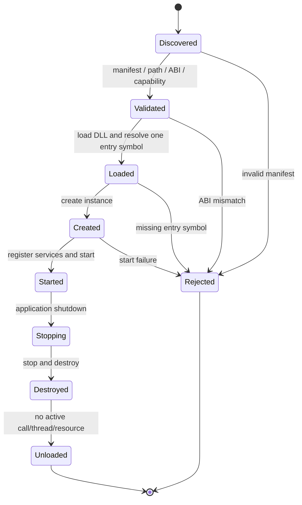
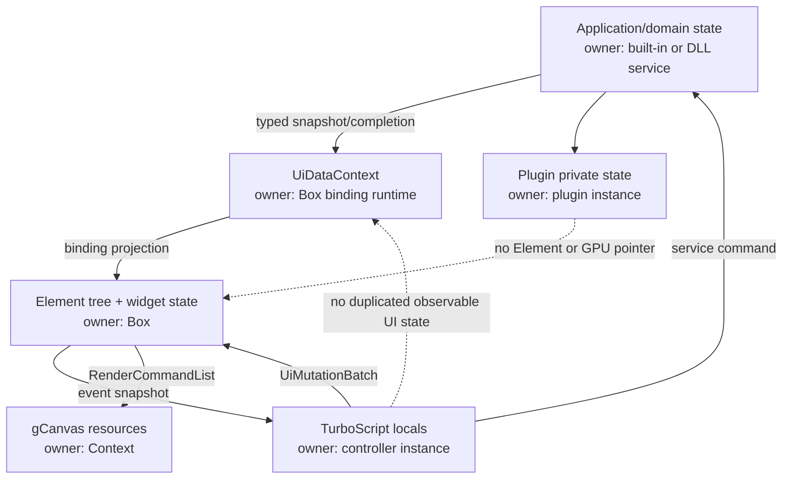
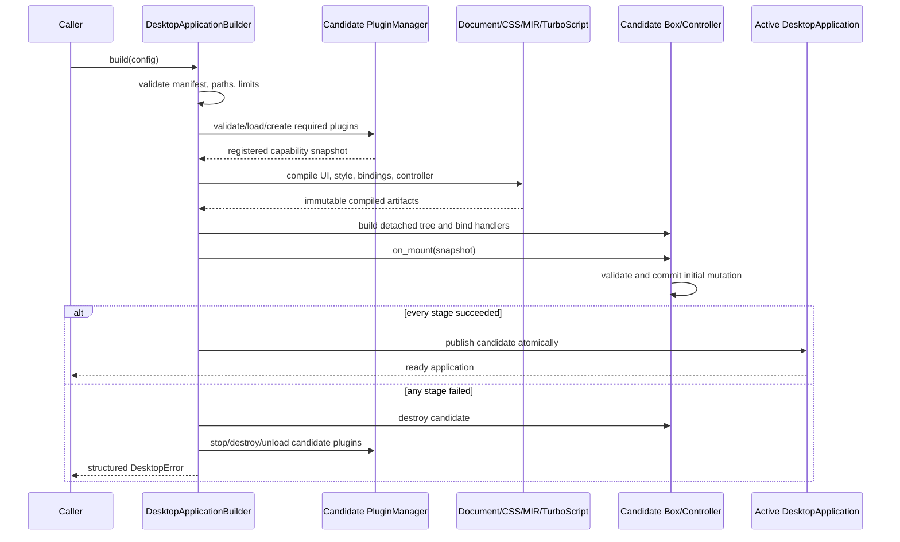
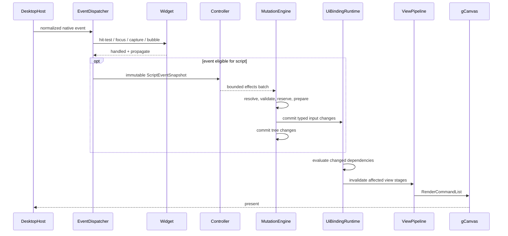

# FlexUI Desktop 应用运行时设计

- 状态：提案，等待按阶段实施
- 日期：2026-08-14
- 首要平台：Windows 桌面，OpenGL 为默认渲染后端
- 控制器语言：TurboScript
- 扩展方式：版本化纯 C ABI DLL 应用服务插件
- 实施清单：[FLEXUI_DESKTOP_PLAN.md](FLEXUI_DESKTOP_PLAN.md)
- 关联设计：[FLEX_UI_DOCUMENT_DESIGN.md](FLEX_UI_DOCUMENT_DESIGN.md)、
  [TURBOSCRIPT_CONTROLLER_DESIGN.md](TURBOSCRIPT_CONTROLLER_DESIGN.md)、
  [ARCHITECTURE.md](ARCHITECTURE.md)

## 1. 决策摘要

FlexUI Desktop 采用类似 Qt Designer `.ui` + QtScript 的开发模型，但不复制 Qt XML、
QObject 或浏览器 DOM：

```text
.flex UI Document + CSS/Tailwind Utility + TurboScript Controller
                              │
                              ▼
                   native FlexUI runtime
                              │
                              ▼
                    gCanvas / OpenGL GPU
```

核心决策如下：

1. 继续使用现有 `.flex` `ui` 块作为唯一核心 UI 文档格式；XML 以后只能作为产生相同
   `UiDocumentDefinition` 的输入适配器。
2. 新增编译后的 `CompiledUiProgram`，集中保存 UI definition、事件绑定、MIR binding、
   source map 和资源引用；不把脚本值或运行时指针放进 definition。
3. TurboScript 是首选且可修改的控制器运行时，不再同时设计 QuickJS/JavaScript 路径。
4. 每个 `Box` 至多一个窗口级 controller；脚本通过事件快照读取输入，通过有界命令批次
   请求修改 UI，不持有 `Element*`。
5. DLL 用于扩展应用服务与 TurboScript host module；插件通过版本化纯 C ABI 和 opaque
   handle 接入，不直接操作 Box、Element、Renderer 或 gCanvas Context。
6. `DesktopApplication` 是装载和运行 Facade；桌面窗口系统与 gCanvas backend 通过 Bridge
   隔离，初始实现可以包装 `gCanvas::Window`，但 FlexUI Core 不依赖 GLFW。
7. 所有装载均构建候选实例；解析、插件、脚本、handler resolution 或 mount 任一失败，
   都销毁候选实例，不发布半初始化应用。

## 2. 背景与仓库事实

### 2.1 事实

- `UiDocumentDefinition` 已是 parser-independent 值语义树，并带 source、node、depth、property
  和 string 资源上限；`UiDocumentInstantiator` 承诺失败时目标 Box 不变。证据：
  `flexUI/include/flexUI/ui_document.h`、`flexUI/src/ui_document.cpp`。
- `.flex` UI 文档已经把 `on.event` 降级为不可变类型化事件表，并提供按 element/event 查询的
  只读索引；实例化时从该表生成可变的 `data-flexui-on-event` 兼容 attribute。TurboScript export
  resolution 与 controller dispatch 尚未实现。证据：`flexUI/include/flexUI/ui_document.h`、
  `flexUI/src/ui_document.cpp`。
- `UiDataContext` 是单线程类型化输入事实源；数值和布尔表达式创建 binding 时编译为 MIR，
  输入版本不变时跳过求值。证据：`flexUI/include/flexUI/binding_runtime.h`、
  `flexUI/src/binding_runtime.cpp`。
- `EventDispatcher` 已集中处理 hit-test、widget consumption、焦点、捕获和冒泡；它应继续作为
  原生事件到脚本事件的唯一转换边界。证据：`flexUI/include/flexUI/event_dispatcher.h`、
  `flexUI/src/event_dispatcher.cpp`。
- `FlexUI::TailwindCSS` 已是独立静态模块，Core 负责 Element 扫描与 stylesheet 应用。证据：
  `flexUI/modules/tailwindcss/CMakeLists.txt`、`flexUI/docs/ARCHITECTURE.md`。
- gCanvas 已把核心 renderer 与可选 GLFW window helper 分离；OpenGL/Vulkan Context 支持
  host-managed native window，Context 与 GPU 资源限定在创建线程。证据：
  `vendor/gCanvas/CMakeLists.txt`、`vendor/gCanvas/docs/host-and-resource-protocol.md`。
- 当前 TurboScript 宿主 ABI 尚不满足重复调用已编译模块、按名称调用 export、结构化错误和
  完整资源限制等 controller 要求。证据与所需能力记录在
  `flexUI/docs/TURBOSCRIPT_CONTROLLER_DESIGN.md`。

### 2.2 推论

- 类似 Qt 的生产力来自“声明式视图、类型化属性、signal/slot、脚本 controller 和原生服务”，
  并不依赖 XML 本身。
- literal XML 与 `.flex` 同时作为核心格式会复制语义验证、source map、热重载和测试矩阵，
  因而 XML 应保持为可选 adapter。
- TurboScript 与 DLL 都必须经过窄宿主边界；把 native pointer 暴露给脚本或 DLL 会破坏
  Box ownership、线程约束和后续 backend 替换能力。

## 3. 目标与非目标

### 3.1 目标

- 首先交付可制作复杂桌面 GUI 的 Windows application runtime。
- 使用 `.flex` 声明 UI、CSS/Tailwind 描述视觉、MIR binding 投影状态、TurboScript 编排行为。
- 支持 C/C++ DLL 注册类型化业务服务，并由 TurboScript 通过 capability namespace 调用。
- 保持 Element、binding input、controller、plugin private state 和 GPU resource 各有唯一 owner。
- 无脚本页面不进入脚本 callback；无动画窗口按需重绘。
- 所有加载、callback、mutation 和 plugin 错误都结构化、可定位、fail fast。
- 保持现有手写 Box、现有 `.flex ui` 文档和无 TurboScript build 的行为稳定。

### 3.2 非目标

- 不实现 HTML、DOM、CSSOM、JavaScript/TypeScript、Node.js、npm 或 Web API 兼容层。
- 不允许脚本遍历整棵 UI tree、直接绘制或逐 property/逐 animation track 执行脚本。
- 不允许 DLL 插件直接调用另一个插件或获得内部 C++ 对象地址。
- 首版不承诺 DLL 热重载、崩溃隔离或运行不可信第三方插件。
- 首版不以移动端、WebAssembly、嵌入式或低于当前 gCanvas backend 要求的 GPU 为目标。
- 不用 TurboScript 替代 CSS cascade、layout、Timeline、easing 或 MIR binding。

## 4. 候选方案

| 方案 | 优点 | 代价与风险 | 结论 |
|---|---|---|---|
| XML + JavaScript runtime | 接近传统 Qt `.ui`，外部工具容易生成 XML | 新增 XML 语义层；JS runtime、GC 和 Web 预期扩大范围 | 不选为核心 |
| `.flex` + TurboScript + native runtime | 复用现有 parser、MIR、Box 和事件系统；部署闭环可控 | 必须完善 TurboScript ABI 和桌面 Facade | 采用 |
| 纯 C++ UI + callback | 最小运行时、静态类型强 | 声明式生产力和快速迭代不足，无法满足 QtScript 类需求 | 保留兼容，不作为主路径 |
| 脚本直接操作 Element/DOM | API 表面灵活 | 生命周期、线程、性能和状态一致性不可控 | 禁止 |

## 5. 总体架构



### 5.1 模块依赖



依赖必须单向。TurboScript、DLL loader、GLFW 和平台头不能出现在 `FlexUI::Core` 公共头中。

### 5.2 设计模式边界

- `DesktopApplication`：Facade，封装插件、文档、样式、脚本、窗口和 GPU 的构建顺序。
- `DesktopApplicationBuilder`：Builder，承载多项可选配置和严格 build validation。
- `IDesktopHost` / `GCanvasWindowHost`：Bridge + Adapter，隔离平台窗口与 gCanvas helper。
- `IScriptModule` / `TurboScriptModule`：Strategy + Adapter，隔离 controller 与脚本 ABI。
- `UiMutation`：`std::variant` Command，已知有限操作集合，不建立深继承树。
- `PluginManager`：生命周期 Facade；插件间只经过 service registry 或 event queue。
- `ControllerState`：显式 State machine，禁止散落布尔状态控制 reload/fault。

## 6. 应用包与配置

建议的应用目录：

```text
my_app/
├── app.toml
├── ui/MainWindow.flex
├── styles/app.css
├── controllers/MainWindow.tbs
├── plugins/document_service/plugin.toml
├── plugins/document_service/document_service.dll
└── assets/
```

概念配置如下；字段名在实现 API 冻结时再形成正式 schema：

```toml
[application]
id = "com.example.editor"
entry_document = "ui/MainWindow.flex"
entry_controller = "controllers/MainWindow.tbs"
stylesheets = ["styles/app.css"]

[window]
title = "Editor"
width = 960
height = 640
backend = "opengl"

[[plugins]]
manifest = "plugins/document_service/plugin.toml"
required = true
capabilities = ["document.read", "document.write"]
```

配置优先级遵循：命令行显式覆盖 > 环境变量 > `app.toml` > 命名默认配置。应用启动时完成
schema、路径、资源上限和 required capability 校验；非法配置直接失败，不静默修复。

## 7. UI Document 与编译 IR

### 7.1 目标语法

现有属性保持兼容。P1 首批已实现的 `bind.*` 语法如下：

```flex
ui MainWindow {
    div root {
        utility: "flex min-h-screen flex-col",

        button save {
            text: "Save",
            utility: "rounded-md px-4 py-2",
            bind.class_enabled: ${can_save},
            on.click: "save_document"
        },

        div status {
            bind.text: $document_status
        }
    }
}
```

P1 当前刻意限定的首批 target 子集是 `text`、`classes`、`utilities` 和 `class_<token>`。
binding runtime 已有的单 utility、attribute 与 custom property 尚未定义稳定的 DSL 命名，不能把
这一首批子集理解为普通 `Element` 的能力上限。`bind.value` 需要 `TextValueWidget` 和双向 observer，而当前 document builder
只创建普通 `Element`，因此编译阶段明确拒绝；后续只有在 widget factory 进入同一装载事务后才可开放。
string target 使用单一 `$input`，class toggle 使用 `${boolean_expression}` 并在安装时校验其
number/bool 输入已经声明。编译产物中的 immutable MIR JIT artifact 由 program 与已安装 binding
共享，不在每次实例化时重新编译；不具备 JIT artifact 时安装直接失败，禁止跨 Box 共享 MIR
interpreter 的可变 context。任一绑定安装失败都会回滚本批绑定、句柄序列和 candidate tree。

解析器继续保持普通 node property 的既有 last-write-wins 行为，但会额外记录重复属性的后一处
source span；FlexUI validation 对重复 `on.*` 和 `bind.*` 单独 fail fast，不让 handler 或 binding
因 map 覆盖而静默改变。binding lowering 在同一 element 内按 source span 排序后检查 ownership：
`bind.classes`/`bind.utilities` 独占完整 class list，不能与另一完整 list binding 或任意
`bind.class_<token>` 共存；不同 token 的 class binding 可以共存。runtime 的 ownership 校验仍然
保留，覆盖手工 API 调用并防止 compiled/load 边界被绕过。

### 7.2 不修改现有 Definition 契约

不向 `UiNodeDefinition` 塞入 runtime handle。新增只读编译产物：

```text
CompiledUiProgram
├── shared_ptr<const UiDocumentDefinition>
├── EventBinding[]
├── BindingDefinition[]
├── UiResourceDefinition[]
├── interned Symbol table
├── SourceMap
└── declared capabilities
```

建议的概念类型：

```cpp
enum class UiBindingTargetKind {
  Text,
  Value, // 为公开枚举的源兼容保留；document lowering 暂不生成
  Classes,
  Utilities,
  ClassToggle
};

struct EventBinding {
  flex::Symbol element_id;
  UiEventKind event;
  flex::Symbol handler;
  SourceSpan source;
};

struct BindingDefinition {
  flex::Symbol element_id;
  UiBindingTargetKind target_kind;
  flex::Symbol target_name;
  MirProgramId program;
  SourceSpan source;
};
```

当前实现使用 `std::string` 保存 element/input 名称，并把 MIR program 留在
`CompiledUiProgram::Impl`；symbol interning 仍是后续 load-path 优化，不是 P1 正确性前提。
现有顶层 `assets {}` 会在同一次 parse 中 lower 为 parser-independent、只读的
`UiResourceDefinition[]`；`UiDocumentLimits::max_resources` 在发布 compiled program 前限制条目数，
超限返回 `ResourceLimitExceeded`，不截断资源表。资源表只描述 type、id、path 和 literal options，
不持有 gCanvas、文件或插件句柄。
`on.*` 的旧
`data-flexui-on-*` attribute 在迁移期可继续由 `EventBinding` 派生，保证现有查询和测试不变，
但 handler table 是唯一事实源，attribute 不能反向修改 handler。`CompiledUiProgram` 通过
`find_event_binding(element_id, event)` 提供只读索引查询；索引以 element `Symbol` 分桶并在命中后
比较完整 element ID 和 event kind，因此不把 32 位 hash 相等误当成身份相等。compatibility
attribute 的修改或删除只改变 Element metadata，不改变查询结果。controller 必须持有共享的
compiled program，Box 和 Element 不维护第二份 handler 状态。

### 7.3 查找复杂度

- load 阶段把 element ID、event name、handler name intern 为 symbol。
- handler resolution 在 load 阶段完成；事件路径按 element handle 和 event kind 做 O(1) 或
  有界哈希查找，不扫描 Element tree。
- binding 表达式只编译一次；运行时沿用输入 version 判定。
- 不提供通用脚本 `querySelectorAll` 热路径；确需查询时由宿主返回有容量上限的 handle snapshot。

## 8. TurboScript Controller

### 8.1 决策

TurboScript 是确定的 controller runtime。FlexUI 仍保留内部 `IScriptModule`，目的不是同时支持
多种脚本语言，而是：

- 隔离 TurboScript C ABI 和生命周期。
- 允许 fake module 做确定性单元测试。
- 防止 exprtk/MIR 内部类型泄漏到 FlexUI 公共 API。
- 让 TurboScript 自身可以独立演进和发布 DLL/static package。

### 8.2 TurboScript 必须补齐的能力

- compiled/module handle 真正持有已解析和 lower 的产物，重复调用不重新解析源码。
- 查询 named export、按名称调用 export，并缓存已解析的 export handle。
- 公开 number、bool、string、null、受限 array/record 的 tagged value 与明确所有权。
- 返回 status + structured error，不用 stdout 作为错误通道。
- 支持 recursion、step、stack、memory、wall-clock/interrupt 预算。
- 规定 context 单线程约束、字符串生命周期和 interrupt 后的销毁/reload 语义。
- 导出可安装的 `TurboScriptConfig.cmake` target，避免把两个仓库源码 target graph 合并。

这些修改在 TurboScript 仓库实施；FlexUI 仅依赖其稳定 public package。

### 8.3 生命周期



每个 Box 最多一个 controller，且 controller、Box、EventDispatcher 和 gCanvas Context 都由同一个
UI 线程访问。`on_frame` 只有模块显式导出且宿主启用时才进入帧路径。

### 8.4 Controller core 数据协议

- `ScriptController` 独占一个 `IScriptModule`，并以 `shared_ptr<const CompiledUiProgram>` 保持
  handler table 的唯一事实源存活；load 失败时候选 module 在函数边界内销毁，活动 Controller
  仍为 `Empty`。
- `IScriptModule` 仅解析 export 并调用已解析的 opaque handle。生命周期 export 和所有
  `EventBinding` 在 load 阶段解析，事件 dispatch 不重复解析 handler 名称。
- `ScriptEventSnapshot` 是不含 `Element*` 的值类型。`ScriptCallContext::event` 是同步调用期间的
  borrowed view，只在 `IScriptModule::call()` 返回前有效；module/adapter 不得保存该指针。
- 该阶段是单生产者、单消费者、同一 UI 线程的直接调用，没有队列和跨线程发布。
  `ControllerLimits` 分别限制 element ID、event text 和 composition text 字节数；超限返回
  `EventLimitExceeded`，不调用 module、不截断输入，也不改变 `Mounted` 状态。
- module 返回错误或抛异常时，Controller 将其转换为一个 `ModuleCallFailed`，丢弃当次结果并进入
  `Faulted`；后续 callback 返回 `ControllerFaulted`。显式 unmount/load 是唯一恢复路径。
- unmount 先进入 `Unmounting` 并调用可选 `on_unmount`，再释放 module 和 compiled program；
  即使 `on_unmount` 失败也完成资源释放并返回结构化错误。

### 8.5 脚本能力

脚本可：

- 读取不可变 `ScriptEventSnapshot`。
- 读取显式暴露的 `UiDataContext` snapshot。
- 提交有界 `UiMutationBatch`。
- 调用 manifest 授权的 application service。
- 启动/停止命名动画，或向 C++ service 提交长任务。

脚本不可：

- 持有 `Element*`、Widget、Renderer、gCanvas resource 或 DLL 函数指针。
- 修改 layout/render cache 或在 paint callback 中执行脚本。
- 直接打开文件、socket、进程或 native dialog；必须调用 capability service。
- 在工作线程调用 Box 或 controller。

## 9. DLL 应用服务插件

### 9.1 定位

DLL 插件用于扩展业务能力，例如文档读写、数据库、设备、系统集成或专用算法。它不是另一套
UI component tree，也不是 renderer backend。插件向 host 注册版本化服务；TurboScript 通过
`service.call("document.save", args)` 之类的受限 bridge 调用。



### 9.2 ABI 规则

跨 DLL 边界只使用纯 C、定宽整数、显式长度 buffer、函数表和 opaque handle：

```c
#define FLEXUI_PLUGIN_ABI_MAJOR 1u
#define FLEXUI_PLUGIN_ABI_MINOR 0u

typedef struct flexui_plugin_instance flexui_plugin_instance;

typedef struct flexui_host_api_v1 {
    uint32_t struct_size;
    uint32_t abi_major;
    uint32_t abi_minor;
    void *host_context;
    flexui_status (*register_service)(void *host_context,
                                      const flexui_service_descriptor *service);
    flexui_status (*post_completion)(void *host_context,
                                     const flexui_completion *completion);
} flexui_host_api_v1;

typedef struct flexui_plugin_api_v1 {
    uint32_t struct_size;
    uint32_t abi_major;
    uint32_t abi_minor;
    flexui_status (*create)(const flexui_host_api_v1 *host,
                            flexui_plugin_instance **out_instance);
    flexui_status (*start)(flexui_plugin_instance *instance);
    flexui_status (*stop)(flexui_plugin_instance *instance);
    void (*destroy)(flexui_plugin_instance *instance);
} flexui_plugin_api_v1;

FLEXUI_PLUGIN_EXPORT
const flexui_plugin_api_v1 *flexui_plugin_get_api_v1(void);
```

这是 ABI 形状而非已冻结头文件。冻结前必须补齐：

- 每个 struct 的 `struct_size`、major/minor 兼容规则和 reserved slots。
- 输入/输出 buffer 的借用或所有权转移规则。
- allocator 归属；禁止 host `free()` 插件分配的对象，反之亦然。
- callback 线程、重入、取消、超时和 shutdown 规则。
- status/error 的创建、读取和释放方式。

### 9.3 插件生命周期



首版只支持启动加载和关闭卸载。热重载必须在后续阶段满足以下条件后单独启用：

- 所有 service call 引用清零。
- 插件创建的线程全部停止并 join。
- 未完成 completion 被取消或迁移。
- 旧插件状态通过版本化 schema 导出，新插件验证后导入。
- 新插件 start/health check 成功后原子切换 service routing；失败保留旧版本。

同进程 DLL 无法提供真正的崩溃隔离。首版只加载可信插件；不可信插件必须以后通过独立进程和
IPC service adapter 隔离，不能用 signal/SEH 后继续运行可能已损坏的进程。

### 9.4 插件依赖与权限

- 插件 manifest 声明 name、semantic version、ABI version、library、required capabilities、
  permissions 和可选依赖。
- required plugin 或 required capability 缺失时应用加载失败。
- optional plugin 只有在 manifest 明确标记 optional 时才可缺失；宿主记录一次诊断，不自动
  切换到语义不同的实现。
- 插件依赖由 host 拓扑排序并拒绝循环；插件不得直接链接另一个业务插件。
- service namespace 全局唯一并版本化，例如 `document.storage/1`。
- 文件、网络、进程和设备访问按 manifest capability 白名单授权。

## 10. 状态所有权



状态约束：

- Element tree 是结构、交互和最终 computed view 的事实源。
- `UiDataContext` 是 binding 可观察输入的事实源；controller 中影响 UI 的长期状态必须写回它。
- application/domain state 归 service；UI 只持有 snapshot 或版本，不维护双向镜像。
- plugin private state 只能由对应 plugin instance 修改。
- mutation batch 和 completion queue 是状态迁移载体，不是第二份业务事实源。

## 11. 装载事务



热重载以后复用同一候选构建协议：新文档、脚本或插件未完整通过验证前，活动窗口继续使用旧实例。

## 12. 事件、service 与渲染顺序



Widget 已消费的事件默认不进入脚本；只有事件 binding 明确允许 post-widget notification 时才产生
只读通知，且通知不能再次触发相同默认动作。capture/bubble/handled 的准确语义必须由测试冻结。

## 13. Mutation 与外部副作用

### 13.1 UiMutationBatch

Controller core 当前使用有限 `std::variant`：

- `SetBindingInputNumber/Bool/String`
- `SetText`
- `SetAttribute` / `RemoveAttribute`
- `SetClasses` / `SetUtilities`

`SetValue`、`StartAnimation`、`StopAnimation` 和 `SendTrigger` 要等对应 Box/animation adapter 能提供
相同事务保证后再加入 variant；当前声明不等于真实 Box host 已开放这些脚本操作。

默认 batch 上限为 256 个 mutation、单字符串 16 KiB、所有字符串合计 64 KiB。element ID、属性名、
input 名和值都计入预算。adapter 创建 batch 时可以使用更严格的上限，但不能放宽 host：
`UiMutationEngine` 会用自己的 limits 重新验证。append 或 apply 超限时立即返回明确错误，batch 和 host
均保持不变。

| Mutation | 事实源/target owner | prepare 前置条件 | 错误 | 真实 host rollback staging |
|---|---|---|---|---|
| `SetText` | Box-owned Element | handle 当前有效、text 有界 | `InvalidTarget` / string limit / host error | 旧 text 与已预留新 string |
| `SetAttribute` / `RemoveAttribute` | Box-owned Element | handle 有效、name 非空且类型允许 | `InvalidTarget` / `InvalidName` / host error | 旧 attribute presence/value 与新 map staging |
| `SetClasses` / `SetUtilities` | Box-owned Element | handle 有效、tokens 可由 style/utility 层完整验证 | target/string/host error | 旧 token set、selector/utility dirty staging |
| `SetBindingInputNumber` | Box-owned `UiDataContext` | name 非空、number finite、kind 不冲突 | `InvalidName` / `InvalidNumber` / host error | 旧 typed value、version 与 invalidation staging |
| `SetBindingInputBool/String` | Box-owned `UiDataContext` | name 非空、kind 不冲突、string 有界 | `InvalidName` / string/host error | 旧 typed value、version 与 invalidation staging |

处理阶段：

1. normalize：检查 batch 数量、字符串、数组和嵌套深度上限。
2. resolve：把 `{id, generation}` handle 解析为当前节点，旧 generation 立即失败。
3. prepare：验证类型和 target ownership，预留容器容量，准备新旧值交换记录。
4. commit：通过只允许无失败 swap/赋值的 mutation adapter 提交。
5. rollback：若 commit 边界仍出现错误，按反向 journal 恢复；rollback 本身必须 `noexcept`。

在现有 Element setter 尚不能提供强异常保证前，对应 mutation 不得进入公开脚本 API。
当前 `IUiMutationHost` 只定义真实 host 必须满足的事务边界，并由 fake host 验证：`prepare()` 不可改变
可观察状态，返回的 `IPreparedUiMutation` 独占所有 staging 且不得保留 batch view；未 commit 的 staging
随 RAII 析构丢弃，`commit()` 必须 `noexcept`、不分配且只调用一次。真实 Box host、generation
失效通知与 stale-handle 验证尚未实现，因此 TurboScript adapter 不得提前暴露这些 mutation。

### 13.2 ApplicationCommand

文件、网络、数据库或设备操作不是 UiMutation。controller 输出独立的有界
`ApplicationCommandBatch`：

1. host 先校验 capability、参数 schema 和 command queue 容量并保留 slot。
2. UI mutation 成功后才发布已保留 command；发布不得再分配或失败。
3. service 同步接受 command，耗时工作可进入其 worker。
4. 完成结果通过有界 UI completion queue 返回，再生成新的 controller event。

外部副作用无法与 UI 内存状态做通用回滚，因此不允许 DLL 在 controller callback 栈内直接执行
不可回滚操作。

## 14. DesktopHost 与 gCanvas

`IDesktopHost` 负责：

- window lifecycle、尺寸、DPI、显示器和 redraw scheduling。
- mouse、keyboard、text input、IME composition、clipboard 和 cursor。
- native dialog、drag/drop、timer 和 UI-thread task posting。
- 创建并保持 gCanvas 所需的 OpenGL context/native callbacks。

gCanvas 负责：

- GPU Context、frame lifecycle、font/image/path resource 和 draw submission。
- OpenGL/Vulkan backend 差异。
- 严格的单线程 Context 和 GPU resource 生命周期。

初始 `GCanvasWindowHost` 可以组合 `gCanvas::Window`，复用其 GLFW helper；IME、clipboard、dialog
等不足能力由 DesktopHost 的平台 service 补齐。长期 native/SDL host 通过相同 Bridge 使用
gCanvas HostManaged/External Context，不修改 FlexUI Core。

首版默认 OpenGL。Vulkan 是 gCanvas backend 的后续可选项，不改变 UI Document、Controller、
binding 或 plugin contract。

## 15. 线程与关闭协议

- UI thread 独占 DesktopHost、Box、EventDispatcher、ScriptController 和 gCanvas Context。
- TurboScript callback 只在 UI thread 运行。
- 插件 lifecycle callback 默认在 UI thread；耗时任务由插件提交到明确的 worker service。
- worker 不能调用 UI API，只能向有界 completion queue 发布值语义消息。
- 窗口关闭顺序：停止新事件 → 取消/排空 command → controller unmount → plugin stop/join →
  destroy Box/controller → 等待 GPU idle 并销毁 Context → destroy native window → unload DLL。
- DLL 在函数调用、callback、worker 或 borrowed buffer 尚存活时不得卸载。

## 16. 错误语义

统一 `DesktopError` 至少携带：

- stage：Config、PluginDiscovery、PluginAbi、DocumentParse、DocumentSemantic、StyleCompile、
  BindingCompile、ScriptCompile、HandlerResolution、Mount、Callback、Mutation、Service、GPU。
- code、message、source path、line/column、element ID、handler/service/plugin name。
- cause chain 中的外部库错误码，但不暴露第三方对象生命周期。

错误策略：

- required plugin/capability、controller、document、style 或 GPU 初始化失败：应用构建失败。
- optional plugin 缺失：仅当 manifest 显式 optional 时允许继续，capability 查询明确返回 unavailable。
- controller callback 错误或超时：丢弃未提交 batch，controller 进入 Faulted，显式 reload 才恢复。
- service command 失败：产生类型化 completion error，不伪装成成功，也不自动改用其他 service。
- GPU/backend 不可用：构建失败，不自动从 OpenGL 切换 Vulkan 或反向切换。
- 错误只在被宿主消费的边界记录一次，避免 parser、adapter、controller 重复打印同一原因。

## 17. 性能与资源边界

- parse、CSS compile、MIR compile、TurboScript compile 和 handler resolution 都在 load/reload 完成。
- event callback 使用 interned symbol、连续 snapshot 和有界 batch，不逐帧扫描 Element tree。
- 无 `on_frame` export 时每帧脚本调用数为零。
- DLL service 以 command/batch 粒度调用，不在每个 Element 或 draw command 上跨 ABI。
- 可增长结构必须由 application limits 配置容量：plugin count、service count、declared resources、event bindings、
  mutation commands、completion queue、script values、controller memory 和 GPU resources。
- 渲染保持 RenderCommandList 路径；controller 和 plugin 不进入 paint replay。

性能验收必须记录：

- cold load：manifest、plugin、document、CSS、MIR、TurboScript、首帧分项耗时。
- steady event：controller call、mutation prepare/commit、binding、layout、paint 分项延迟。
- idle frame：无动画无事件时 CPU 占用和 callback 数。
- memory：基础应用、每 1000 nodes、每 plugin、script context 和 GPU resource 峰值。
- stress：大量 binding、事件 burst、completion queue 饱和、窗口 resize 和 DPI 切换。

具体门槛在 benchmark 基线建立后冻结，不能凭理论值宣称优于 Electron、WebView 或 Qt。

## 18. CMake 与部署

计划 targets：

```text
FlexUI::Core
FlexUI::Document
FlexUI::TailwindCSS
FlexUI::Controller
FlexUI::ControllerTurboScript
FlexUI::PluginHost
FlexUI::Desktop
```

规则：

- `FLEXUI_ENABLE_TURBOSCRIPT` 控制 adapter；启用时使用
  `find_package(TurboScript CONFIG REQUIRED)`。
- `FLEXUI_ENABLE_PLUGINS` 控制 DLL host；关闭时不编译 loader，静态应用行为不变。
- `FlexUI::Desktop` 私有链接平台 window adapter；FlexUI 公共文档/状态类型不包含 GLFW/Win32。
- DLL 使用单独 SDK target，只导出稳定 C header 和 import definitions。
- Debug/Release runtime、CRT、calling convention、visibility 和 struct packing 都进入 ABI compatibility test。
- 应用部署包含可执行文件、TurboScript runtime、所选 gCanvas backend、plugin manifests/DLL 和 assets；
  不包含源码树绝对路径。

## 19. 兼容性、迁移与回滚

### 19.1 兼容性风险

- 新增 `bind.*` 会扩展 Flex DSL 保留 property 语义，但不应改变其他 attribute 的解析。
- `on.*` 从 metadata 升级为类型化 handler 后，未知 handler 将由“点击后无行为”变为 load error；
  这是有意的 fail-fast 用户可见变化，需提供诊断和迁移说明。
- controller 插入事件链可能改变 handled/propagate 顺序，必须先冻结事件契约。
- TurboScript 和 plugin targets 增加部署文件、ABI 和许可检查。
- DesktopHost 替换示例 GLFW glue 后可能改变 DPI、键值和 text input normalization。

### 19.2 迁移路径

1. 新增 `CompiledUiProgram`，保留 `parse_ui_document` 和 `UiDocumentInstantiator`。
2. `on.*` 生成唯一 handler table，并由该表投影可变兼容 attribute；attribute 修改不反写事件表。
3. controller 先接 fake module，不改变默认 Box 事件路径。
4. TurboScript adapter 由显式 feature 和 application builder 启用。
5. DLL plugin host 先独立测试，再向 controller service bridge 注册 capability。
6. DesktopApplication 示例与现有手写 Box 示例并存，稳定后再迁移主示例。

### 19.3 回滚

- 关闭 TurboScript/plugin feature，回到现有 C++ callback、binding 和 animation 路径。
- 不创建 DesktopApplication 时，Box 公开行为不变。
- controller 创建失败不会接管 EventDispatcher callback。
- plugin load/start 失败时按相反顺序销毁已成功创建的候选插件，活动应用不变。
- OpenGL backend 独立于 controller/plugin；脚本或 DLL 回滚不改变 renderer contract。

## 20. 风险审查

| 等级 | 证据类型 | 风险与影响 | 控制措施 |
|---|---|---|---|
| HIGH | 事实 | TurboScript 当前缺少所需稳定宿主 ABI，直接集成会依赖内部生命周期 | 先在 TurboScript 仓库完成 public C ABI、limits 和 package tests |
| HIGH | 推论 | DLL 可破坏宿主进程内存，无法在同进程可靠恢复 | 首版只加载可信插件；不可信插件以后进程隔离 |
| HIGH | 事实 | 当前 Event 包含裸 `Element* target`，不能直接复制到脚本/DLL | 构造值语义 snapshot，只含 handle 和有限字段 |
| HIGH | 推论 | mutation 与外部副作用混合会产生不可回滚状态 | 分离 UiMutation 与 ApplicationCommand，先 reserve 再发布 |
| MED | 事实 | handler export 尚未在 TurboScript load 边界解析 | controller 接入时增加带 source span 的 export resolution；兼容 attribute 不参与解析 |
| MED | 推论 | literal XML 双栈会扩大迁移和测试成本 | XML 仅作为同一 definition 的 adapter |
| MED | 事实 | gCanvas Context 单线程且 host/window 有明确销毁顺序 | DesktopHost 固化 UI-thread 和 shutdown protocol |
| MED | 推论 | 热重载 DLL 容易遗留函数指针和 worker | 首版不启用；后续需引用清零、状态迁移和原子路由 |
| LOW | 推论 | `.tbs` handler 字符串易产生拼写错误 | load-time export resolution 和 source-located error |

## 21. 架构验收条件

设计落地后必须满足：

- 不含 controller/plugin 的现有 FlexUI tests 和 command snapshots 行为不变。
- application load 任一阶段失败都不发布 window/Box/controller/plugin 半状态。
- handler 在 load 阶段解析；不存在的 required handler 给出源位置。
- callback 错误、超时、stale handle 或超额 batch 不提交部分 UI 状态。
- DLL ABI 在独立 MSVC Debug/Release consumer 中完成 load/call/stop/unload 测试。
- plugin 无法从 public ABI 获得 Element、Renderer、gCanvas Context 或跨模块 C++ container。
- UI thread、worker completion、shutdown 和 window close 的测试无悬空 callback。
- 无脚本、无 plugin、无动画窗口不产生脚本/plugin frame callback。
- OpenGL GPU smoke、resize、DPI、text input、IME、clipboard 和 focus 回归通过。
- benchmark 给出可复算基线，不用未经测量的“快于 Electron/Qt”作为完成结论。

