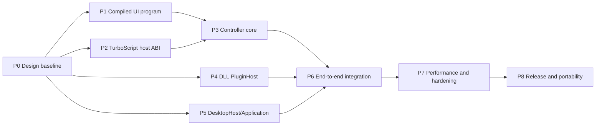

# FlexUI Desktop TODO Checklist

- 状态：待实施
- 日期：2026-08-14
- 设计依据：[FLEXUI_DESKTOP_DESIGN.md](FLEXUI_DESKTOP_DESIGN.md)
- TurboScript 专项：[TURBOSCRIPT_CONTROLLER_PLAN.md](TURBOSCRIPT_CONTROLLER_PLAN.md)
- 当前格式决策：[XML_CSS_TBS_ARCHITECTURE.md](XML_CSS_TBS_ARCHITECTURE.md)
- 首要目标：Windows 桌面 + TurboScript + DLL application service + gCanvas/OpenGL

## 1. 使用规则

- `[x]` 只表示已有仓库证据或本阶段验收全部通过，不表示愿景已实现。
- 每阶段先运行最小相关测试，再运行相邻回归；未运行必须记录原因和剩余风险。
- 公开 API、DSL 语义、配置 schema 或 DLL ABI 变化在实施前单独审查。
- 不通过 silent fallback、异常吞噬、自动 backend 切换或自动脚本解释器切换通过测试。
- 不向跨模块接口暴露 `Element*`、Renderer、gCanvas resource、exprtk/MIR internal handle 或
  C++ STL container。
- 先实现 fake module/plugin，再接真实 TurboScript/DLL，确保宿主状态机可独立测试。
- checklist 中的建议路径可在结构审计后调整，但模块职责与依赖方向不能被穿透。

## 2. 阶段依赖



P1、P2、P4、P5 可以独立推进；P6 前必须全部完成。不得为提前演示绕过任何前置契约。

## P0：设计与基线

### 仓库事实

- [x] 同步 CodeGraph 并审阅 UI Document、Box、EventDispatcher、binding runtime、TailwindCSS、
  TurboScript controller 文档和 gCanvas host protocol。
- [x] 确认 `UiDocumentInstantiator` 已有 validate/build/commit 和失败不修改 Box 契约。
- [x] 确认 P0 基线中的 `on.*` 仅生成 `data-flexui-on-*` metadata。
- [x] 确认 binding 表达式已有 MIR compile-once 与 input version 跳过机制。
- [x] 确认 gCanvas renderer 与可选 GLFW window helper 已分离，Context 为单线程。

### 决策

- [x] 2026-08-31 更新：确定 XML 为目标 UI 文档；`.flex` 仅在迁移期输出同一 compiled IR。
- [x] 确定 TurboScript 为 controller runtime，不接入 QuickJS/JavaScript/npm。
- [x] 确定 DLL 只扩展 application service/TurboScript host module。
- [x] 确定 DLL 采用版本化纯 C ABI、opaque handle 和 capability registry。
- [x] 确定首版 DLL 仅启动加载/关闭卸载，不承诺热重载或不可信插件隔离。
- [x] 确定 Windows + OpenGL 是第一个交付矩阵，Vulkan 不改变上层契约。
- [x] 完成总体设计、状态所有权、装载事务、事件流、错误语义、迁移和回滚文档。

完成条件：设计文档与 checklist 可从本文件互相跳转；尚未改动运行时公开行为。

## P1：Compiled UI Program 与 DSL lowering

### API 与数据结构

- [x] 设计 `CompiledUiProgram` 的公开/私有边界，保留现有 `UiDocumentDefinition` 契约。
- [x] 定义 `EventBinding`、`BindingDefinition` 和 `SourceSpan`；interned symbol ownership 留待 load-path 优化。
- [x] 定义支持的 `UiEventKind`，拒绝任意未知 `on.*` 名称。
- [x] 冻结 P1 首批 `UiBindingTargetKind` DSL 命名为 text/classes/utilities/class toggle；
  runtime 的单 utility、attribute 与 custom property 不在 P1 compiled document 范围内。
- [x] 明确 compiled program 的不可变性、共享方式、线程约束和销毁顺序。
- [x] 为 event/binding 数量增加可配置上限和结构化错误码。
- [x] 为 resource 数量增加可配置上限和结构化错误码。

### Parser 与 semantic lowering

- [x] 扩展 `.flex ui` property semantic，识别并校验 `bind.*`。
- [x] 将 `on.*` lower 为类型化 `EventBinding`，保留 source location。
- [x] 将 bool `bind.*` 表达式编译为 MIR program，string binding 收集直接 input dependency。
- [x] 在 load 阶段拒绝重复 `on.*`/`bind.*` 属性，并报告后一处属性的 source span。
- [x] 在 compiled lowering 阶段拒绝 class-list/class-token target ownership 冲突；runtime
  继续保留同语义校验作为防线。
- [x] 拒绝首批 string target 的非单 input 表达式和 class toggle 的非法 MIR 表达式。
- [x] 保留 `data-flexui-on-*` 为 compiled event table 的兼容投影。
- [x] compiled event table 提供 element/event 的只读索引查询；runtime attribute mutation
  不会反向修改 handler table。
- [x] 保持 `scene`、component 和现有未知普通 property lowering 不变。

### Instantiation

- [x] 让 instantiator 接受 compiled program，不破坏旧 definition 入口。
- [x] detached build 阶段解析所有 element ID target。
- [x] binding 安装失败时销毁 candidate tree，Box root/index/bindings/handle sequence 保持不变。
- [x] 成功后 Box 仍是 Element tree 唯一 owner，compiled program 仅为只读模板。

### 测试

- [x] lexer/parser：`bind.*`、`on.*`、source span、逗号与嵌套语法。
- [x] semantic：未知 event/target、重复 event/binding、binding ownership 冲突、类型错误和
  event/binding 数量超限。
- [x] semantic：resource 超限。
- [x] MIR：数字/布尔/string 输入、dependency version 和 invalid expression。
- [x] compatibility：旧 `on.*` attribute 查询结果不变。
- [x] binding install：text/classes/utilities 与 MIR class toggle 随 input version 更新，且复用 compiled MIR。
- [x] binding transaction：失败不安装 root/index/bindings，且不消耗 binding handle。
- [x] assets、component、scene 与 ui 顶层结构互不吞噬的回归。

完成条件：`.flex` 可生成不可变 compiled program；脚本尚未接管事件；现有 UiDocument API 和
测试保持兼容。

## P2：TurboScript 稳定宿主 ABI

本阶段在 TurboScript 仓库实施。FlexUI 不通过 private/internal header 绕过该阶段。

### Compiled module

- [ ] 让 compiled/module handle 持有已解析和 lower 的可重复执行产物。
- [ ] 增加 export 查询、按名称调用和稳定 export handle。
- [ ] 重复调用 export 不重新解析源码。
- [ ] 定义 module/context 的 create、compile、instantiate、reset 和 destroy 顺序。
- [ ] 明确一个 context 的线程归属与 reentrancy 规则。

### Value 与错误 ABI

- [ ] 定义公开 tagged value：null、bool、number、string、bounded array/record。
- [ ] 写明所有 input/output value、string 和 error buffer 的所有权与有效期。
- [ ] 定义 `status + structured error`，禁止只向 stdout/stderr 报错。
- [ ] 错误包含 module、function、source location、phase 和 cause code。
- [ ] ABI 使用纯 C 和 opaque handle，不暴露 exprtk/MIR arena/value。

### 预算与中断

- [ ] 增加 recursion、step/loop、stack、memory 和 wall-clock limits。
- [ ] 增加 host interrupt callback。
- [ ] 验证 timeout/interrupt 后 context 可安全销毁；若不可继续使用，明确要求 reload。
- [ ] 首版明确同步 callback；async job 若保留，必须有显式 pump、取消和 shutdown。

### Package 与验证

- [ ] 导出可安装 `TurboScriptConfig.cmake` 和稳定 imported target。
- [ ] 验证 MSVC Debug/Release runtime 和 shared/static 组合。
- [ ] 添加独立 C host 和 C++ host consumer tests。
- [ ] 覆盖 load/call/repeat/error/type/ownership/interrupt/stale module。
- [ ] MIR interpreter/JIT 同输入结果一致。
- [ ] 建立 compile、first call、steady call 和 interrupt latency benchmark。

完成条件：独立 host 只包含 TurboScript public header 即可安全加载、重复调用 export、限制资源并
获得结构化错误。

## P3：Controller core 与 mutation transaction

### 模块与接口

- [x] 新建 `FlexUI::Controller` target，不依赖 TurboScript headers。
- [x] 定义不超过 10 个方法的 `IScriptModule` 小接口。
- [x] 定义 `ScriptController` 显式状态机：Empty/Compiled/Mounted/Dispatching/Faulted/Unmounting。
- [x] 定义 bounded `ScriptEventSnapshot`，不复制 `Event::target` 裸指针。
- [x] 定义 `{id, generation}` `UiHandle` 和 generation 失效规则。
- [x] 定义 `UiMutation` `std::variant` 与 `UiMutationBatch` limits。
- [x] 定义有界 `ApplicationCommandBatch`，与 UI mutation 分离保存在 `ScriptCallResult`。
- [x] candidate mount 前解析 compiled handler table；失败返回 element、event、handler 和 source span。

### Fake module

- [x] 实现 test-only fake module，支持 export presence、call result、timeout 和 injected error。
- [x] 测 mount/event/optional-frame/unmount 调用顺序。
- [x] 测无 `on_frame` 时帧路径零 script callback。
- [x] 测 fault 后拒绝新 callback，显式 reload 才恢复。
- [ ] 测 module/controller/Box 析构顺序和 callback 中关闭窗口。
- [x] 测 handler resolution 或 callback timeout 时 Box root/index/bindings 与 mutation state 均不变。

### Mutation engine

- [x] 将 normalize、resolve、prepare、commit/discard 拆成明确阶段；prepare 失败或丢弃 staging
  即为 rollback，commit 边界无失败操作。
- [x] 为每种 mutation 写明 target owner、前置条件、错误码和 rollback 数据。
- [x] commit 前完成所有分配并准备最终值 swap；丢弃 staging 为 `noexcept` RAII rollback。
- [x] `BoxMutationHost` 不调用可能分配的 Element setter，按实际触及字段准备最终 state 并 swap。
- [x] stale/detached/widget-owned handle、错误 input 类型、未知 utility、超额 batch 立即失败；
  同一 target 的多条 mutation 在单一 staging 中按 batch 顺序合并。
- [x] controller 先通过 `IApplicationCommandQueue` reserve，再在 UI commit 成功后无失败 publish；
  UI 失败时 reservation 自动取消。
- [x] command publication 只入队、不执行；mount/unmount command fail fast，不可回滚副作用不在
  controller callback 栈内执行。

### TurboScript adapter

- [x] 新建 `FlexUI::ControllerTurboScript` target 和 opaque adapter。
- [x] 使用 `find_package(TurboScript CONFIG REQUIRED)`，不 `add_subdirectory` 外部源码。
- [x] TurboScript types 只存在于 adapter `.cpp`。
- [x] 缓存 required/optional exports 和转换后的 handler table。
- [x] 将 TurboScript errors 转换为统一 controller error，不重复记录日志。
- [x] adapter contract tests 覆盖 real module load/call/error/interrupt 与 effect batch 解码。

完成条件：fake 与真实 TurboScript module 都通过同一 controller contract；callback 失败不产生部分
UI 状态，默认 Box 路径仍未被隐式接管。

## P4：DLL PluginHost 与 service registry

### ABI SDK

- [ ] 新建稳定 C header，定义 ABI major/minor、`struct_size` 和 reserved slots。
- [ ] 定义一个固定 entry symbol，例如 `flexui_plugin_get_api_v1`。
- [ ] 所有 handle opaque；buffer 使用 pointer + length，不传 STL、异常或 C++ class。
- [ ] 定义 calling convention、visibility、packing、UTF-8 和定宽整数规则。
- [ ] 定义 allocator/ownership；跨 CRT 不允许对方释放本模块内存。
- [ ] 定义 status/error object 的读取和释放规则。

### Manifest 与依赖

- [ ] 定义 `plugin.toml` schema：name、version、ABI、library、required/optional dependencies、
  services、capabilities 和 permissions。
- [ ] 使用 TurboParser/DataBind 或仓库既有 TOML 入口解析，不手写 parser。
- [ ] 验证路径规范化、文件大小、name/version 长度和重复 plugin ID。
- [ ] required dependency 缺失或版本不匹配 fail fast。
- [ ] optional 仅在 manifest 显式声明时允许缺失，不静默替换实现。
- [ ] 拓扑排序依赖并拒绝循环。

### Loader 与生命周期

- [ ] 通过 TurboUtils 平台动态库封装加载/查符号/卸载，不直接散落 Win32 API。
- [ ] 实现 Discovered/Validated/Loaded/Created/Started/Stopping/Destroyed/Unloaded 状态机。
- [ ] construction failure 按相反顺序 RAII unwind。
- [ ] stop 前拒绝新 service call，并等待活动调用归零。
- [ ] 插件 worker 必须支持 stop/join，卸载前确认无 callback、thread 或 borrowed buffer。
- [ ] 首版明确禁止热重载 API；开发模式 reload 通过重启进程完成。

### Service registry

- [ ] service namespace + major version 全局唯一。
- [ ] 插件只向 host 注册 service，不直接解析其他 DLL 的符号。
- [ ] TurboScript 只能调用 application manifest 授权的 capability。
- [ ] service 参数/返回值使用受限 tagged value/schema，不传 UI 或 GPU handle。
- [x] 实现 application-owned bounded MPSC completion mailbox；copy ownership、固定容量、非阻塞
  `QueueFull`、owner-thread consumer、generation 淘汰、close quiescence/cancel 和统计均有测试。
- [ ] 长任务返回 request ID，结果通过 bounded completion queue 投递 UI thread。
- [ ] queue 满、取消、窗口关闭和 plugin stop 都有明确错误语义。

### 安全与测试

- [ ] 首版文档明确“同进程、可信插件”，不宣称 crash isolation。
- [ ] 权限默认拒绝；文件、网络、进程、设备分别授权。
- [ ] 测错误 ABI、缺失 symbol、create/start/stop 失败和重复注册。
- [ ] 测跨 CRT buffer、字符串生命周期、double unload 和 use-after-unload 防护。
- [ ] 测依赖拓扑、循环、required/optional 和 capability denial。
- [ ] 使用 ASan/UBSan 可用配置验证 repeated load/start/stop/unload。
- [ ] 建立独立示例 DLL 和 install-tree consumer test。

完成条件：可信 DLL 可注册一个类型化 service，TurboScript 经 host bridge 调用并收到 completion；
插件不能访问 Element、Renderer 或 gCanvas Context。

## P5：DesktopHost 与 DesktopApplication

### Host bridge

- [ ] 定义最小 `IDesktopHost`，按 window、input、platform service 拆分超过 10 方法的接口。
- [x] 定义 gCanvas mouse、wheel、key、text 与 resize 到 FlexUI `Event`/viewport metrics 的
  strict normalization 契约；非法值不修改缓存的指针位置。
- [x] 定义 logical size、framebuffer size、content scale 和 pointer 坐标转换唯一规则；
  `native_pixel_size` 使用同一 metrics 事实源的显式像素模式。
- [x] 定义 redraw-on-demand、continuous timed wait 和 window close 调度；event-driven 模式 idle 时
  阻塞，Box/RenderManager 仍以 dirty state 决定是否提交绘制。
- [x] 定义 text input 与 IME composition 的 application owner-thread gate；无合格焦点明确返回
  success/not-dispatched，实际派发保留完整 `DesktopApplicationError`。
- [x] 实现 `GCanvasApplicationInputRouter`：owner-thread gate → strict normalization →
  `DesktopApplication` dispatch/viewport update；normalization 与 application error 保持独立来源。
- [ ] 定义 clipboard、cursor、drag/drop 和 dialog 边界。

### Windows 首实现

- [x] 实现 `GCanvasWindowHost`，组合可选 `gCanvas::Window`，不让 Core 链接 GLFW。
- [ ] 创建 OpenGL context 并验证 backend capabilities，不自动切 Vulkan。
- [x] 实现与真实窗口解耦的 mouse、wheel、key、text、resize 值转换。
- [x] 以 headless application 测试验证 gCanvas 输入路由、focused text gate、key repeat、resize
  invalidation，以及跨线程拒绝不会污染 normalizer 指针缓存。
- [x] 在 `GCanvasWindowHost` 接入已具备的 focus、close event 与 scoped listener 生命周期。
- [x] 为 `gCanvas::Window` 增加 listener-scoped removal，避免 host 销毁后遗留 callback；不得使用
  清除其他 owner 监听器的全局 reset 作为生命周期协议。
- [x] 为 `gCanvas::Window` 增加 Windows native pointer capture 原语；不支持的平台明确拒绝，不以
  cursor confinement 代替 GUI capture。
- [x] `GCanvasApplicationInputRouter` 在 owner thread 处理 focus loss，清除 Box focus/internal capture；
  gCanvas 在发布失焦前先释放 Windows native capture。
- [x] `GCanvasWindowHost` 在 pointer event 与 frame 后将 FlexUI internal capture 与 native capture 同步。
- [ ] 补齐 Windows IME、clipboard、DPI、多显示器和 native dialog service。
- [x] 主循环静态窗口使用 wait-events；动画/主动刷新使用 bounded timed-wait/update，避免 busy poll。
- [x] 分离 logical window resize 与 physical framebuffer resize；zero framebuffer 不提交 GPU frame，
  丢弃本帧 draw queue/transient path resource，恢复后不回放最小化期间的旧命令。
- [ ] 完成 native minimize/restore、device/context error 和 shutdown stress 回归。

### DesktopApplication Facade

- [x] 定义 `DesktopApplicationBuilder` 的 XML/CSS/script factory/limits/registry 子集；manifest、
  services 和 required resources 留待 package/plugin 阶段。
- [x] Builder 构建 compiled artifacts、Box、mutation engine 和 Controller candidate；PluginManager
  与 Host 留待对应阶段。
- [x] required export、`on_mount` 成功后才发布 ready application。
- [x] build 任一失败按 RAII 销毁候选资源，调用方获得保留 nested error 的 structured error。
- [x] 定义 application reload 的 owner-thread 与 atomic candidate swap。
- [x] 实现 `Ready -> CloseRequested -> Shutdown` 状态机；close 后拒绝 event/reload，shutdown 明确
  unmount 且保留 published state，callback 内拒绝 unmount 时可在返回后重试。
- [x] 由 DesktopHost 实现 run/main-loop 并驱动 request_close/shutdown；native callback 只请求 close，
  controller unmount 在 callback 返回后的 host 边界执行。
- [x] 不使用 global singleton/service locator；renderer、registry 和 script factory 显式注入。

### 测试

- [x] 无 GPU headless 测 application build/reload transaction、strict CSS、typed widget、mount failure
  与跨线程 reload 拒绝。
- [x] hidden real window 测 OpenGL/Vulkan create/render/readback/resize/present，并在 Windows 验证
  native capture acquire/release。
- [x] hidden `GCanvasWindowHost` 测 OpenGL/Vulkan application 首帧、pointer capture 同步、owner-thread
  gate 和 `Ready -> CloseRequested -> Shutdown`。
- [x] DPI/resize 坐标与 hit-test 一致；覆盖 native window extent 到 logical viewport 的比例变化，
  resize 后同一 logical pointer 仍命中同一 Element。
- [x] keyboard、text、IME 与内部 pointer capture 回归。
- [x] native focus/capture 与 clipboard 回归；Windows GPU smoke 验证 focus loss 在通知
  listener 前释放 native capture，application router 清理 Box focus/capture，widget 覆盖 UTF-8
  clipboard copy/cut/paste round-trip。
- [x] close/shutdown during controller callback 保持可重试状态且不会重复 unmount。
- [x] close during service completion mailbox 安全；并发 producer 在 close 前完成 publication 或得到
  `Closed`，close quiesce 后取消全部已发布 record；PluginHost stop/join 仍由 P4 lifecycle 完成。
- [ ] required GPU capability 缺失时无半初始化 window/context。

完成条件：Windows 示例可以从 app package 启动、按需绘制、输入文本、调用 native service 并安全
关闭；Core 仍不包含平台窗口依赖。

## P6：端到端应用集成

### 事件与 controller

- [x] 在 widget consumption 与 target→ancestor bubbling 中生成 pointer-free script event snapshot。
- [x] 冻结首阶段 handled/propagate/bubble 语义：consumed event 不进入脚本，click 在 native MouseUp
  route 后合成；capture target 与 physical hover/click hit 分离，且 consuming MouseUp 后释放 capture。
- [ ] 定义显式 post-widget consumed notification、native capture 同步与 window focus 组合。
- [x] load 时解析所有 required handler，未知 handler 给出 XML source location。
- [x] callback 成功后一次提交 mutation；DesktopHost 接入后再统一 frame pipeline 调度。
- [x] controller fault 后 UI 保持最后一次有效状态，显式 reload 才恢复 callback。

### Service 调用

- [x] controller effect 同时包含 UI mutation 和 reserved application command。
- [ ] required capability 在 application build 阶段验证。
- [ ] command completion 转换为不可变 controller event。
- [ ] completion 到达已关闭/reloaded controller 时安全丢弃并返回取消状态。
- [ ] service error 不自动 fallback，UI 由 controller 显式处理错误 completion。

### 示例应用

- [ ] 新增完整桌面 editor 示例：XML、CSS、`.tbs`、C++ host、document service DLL。
- [ ] 示例支持编辑、dirty binding、save command、saving 状态和错误提示。
- [ ] 示例不在生产代码嵌入测试数据或本机绝对路径。
- [ ] 示例可从 build tree 和 install tree 独立运行。

### 回归

- [ ] 无 controller Box 行为与 command snapshot 不变。
- [x] `FLEXUI_ENABLE_TURBOSCRIPT=OFF` configure/build/test 通过。
- [ ] `FLEXUI_ENABLE_PLUGINS=OFF` configure/build/test 通过。
- [ ] 两 feature 同时关闭时不部署 TurboScript/plugin runtime。
- [ ] 现有 hand-built examples 与 UiDocument tests 通过。

完成条件：`XML + CSS + .tbs + DLL` 构成完整桌面应用闭环，且每个 feature 可以独立关闭。

## P7：性能、安全与稳定性收口

### Benchmark

- [ ] 建立 cold load 分项 benchmark：plugin/document/CSS/MIR/TurboScript/first frame。
- [ ] 建立 steady callback、mutation commit、binding update 和 frame benchmark。
- [ ] 覆盖典型、峰值和资源上限：1k/10k nodes、binding burst、event burst、queue saturation。
- [ ] 记录每帧 allocation；热事件路径避免动态分配和字符串查找。
- [ ] 验证无 `on_frame` 时零 script frame call，idle 窗口按需唤醒。
- [ ] 只有 profile 证明占总耗时至少 20% 时才实施通用能力手写优化。

### 资源与故障

- [ ] 脚本 infinite loop、deep recursion、memory exhaustion 和 timeout/interrupt。
- [ ] plugin queue saturation、worker hang、stop timeout 和 lost completion。
- [ ] mutation stale handle、oversized string、invalid UTF-8、integer overflow 和 rollback。
- [ ] GPU resize storm、minimize/restore、context loss/error 和 resource limit。
- [ ] application reload 过程中 native event、completion 和 close 竞态。

### Sanitizer 与诊断

- [ ] ASan：controller reload、Box subtree replacement、plugin unload、GPU shutdown。
- [ ] UBSan：tagged value、ABI conversion、enum/range 和 arithmetic。
- [ ] TSan 可用平台：completion queue 和 plugin worker shutdown。
- [ ] 错误只在宿主消费边界记录一次，包含 stage、module/plugin、handler/service 和 cause。
- [ ] 热路径不记录 INFO 日志；debug tracing 有容量/采样限制。

完成条件：所有资源边界有测试，关闭路径无悬空 callback/thread/handle；性能结论有可复算数据。

## P8：发布、ABI 与跨平台

### Windows 发布门槛

- [ ] MSVC Debug/Release build 与 CTest 通过。
- [ ] install/export targets 与独立 consumer 通过。
- [ ] 应用包不包含源码树、本机绝对路径或未声明 DLL。
- [ ] 检查 TurboScript、gCanvas、GLFW、插件 SDK 和其他依赖许可证。
- [ ] 记录 executable、runtime、每 plugin 和 GPU backend 二进制体积。
- [ ] 定义 plugin SDK semantic version 与 ABI compatibility policy。
- [ ] 对 DLL manifest/hash/signature 的生产策略形成明确配置。

### 后续平台

- [ ] Linux host：X11/Wayland、IME、clipboard、DPI 和 OpenGL smoke。
- [ ] 评估 macOS OpenGL 生命周期与长期 Metal/Vulkan 策略，不先承诺支持矩阵。
- [ ] Vulkan backend 通过同一 DesktopHost/Renderer contract 接入，上层 snapshot 不变。
- [ ] XML frontend 输出同一 compiled program，并完成 Qt Designer/import 可行性验证。
- [ ] 不可信插件只有在独立进程 IPC、权限和 crash recovery 完成后开放。
- [ ] DLL hot reload 只有在 state schema、引用清零、worker join 和 rollback 全部验证后开放。

完成条件：发布文档只列出实际构建测试通过的平台/backend/feature，不把推论写成支持事实。

## 3. 每次提交的最小验证模板

根据改动范围选择最小集合，并把实际命令与结果写入提交说明：

```powershell
cmake --build --preset win-dev-user --target <smallest-related-target> --parallel 4
ctest --preset win-dev-user -R "<smallest-related-test-regex>" --output-on-failure
```

扩大回归时至少覆盖：

- UI Document / parser semantic tests。
- binding runtime tests。
- EventDispatcher / render semantics tests。
- controller fake/real adapter contract tests。
- plugin ABI/load/lifecycle tests。
- DesktopHost hidden-window GPU smoke tests。
- feature-off configure/build tests。

## 4. 完成定义

只有同时满足以下条件，FlexUI Desktop 才能宣称进入可用阶段：

- [ ] 桌面应用能仅靠 app package 创建，无需手写 Element tree glue。
- [ ] UI、样式、binding、controller 和 DLL service 的错误均有源位置或服务上下文。
- [ ] Box、UiDataContext、controller、plugin 和 gCanvas resource 的 owner/lifetime 可由测试证明。
- [ ] callback、mutation、service 和 application reload 不产生半提交状态。
- [ ] 无脚本、无插件路径保持兼容且无额外逐帧开销。
- [ ] Windows OpenGL 交付矩阵的输入、IME、DPI、clipboard、resize、focus 和 shutdown 通过。
- [ ] TurboScript 和 DLL ABI 均有 install-tree 外部 consumer 测试。
- [ ] 性能、安全、资源上限、部署文件和许可证均有记录。

