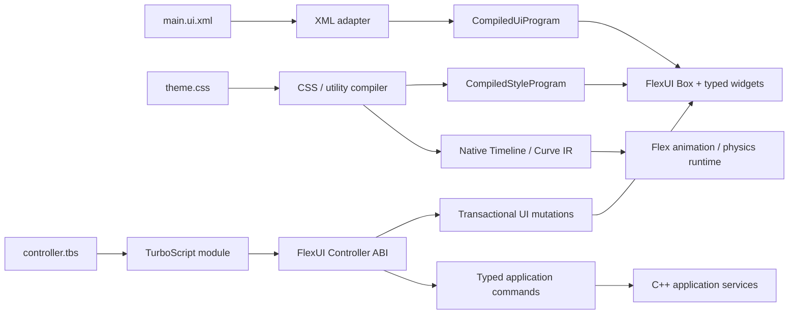
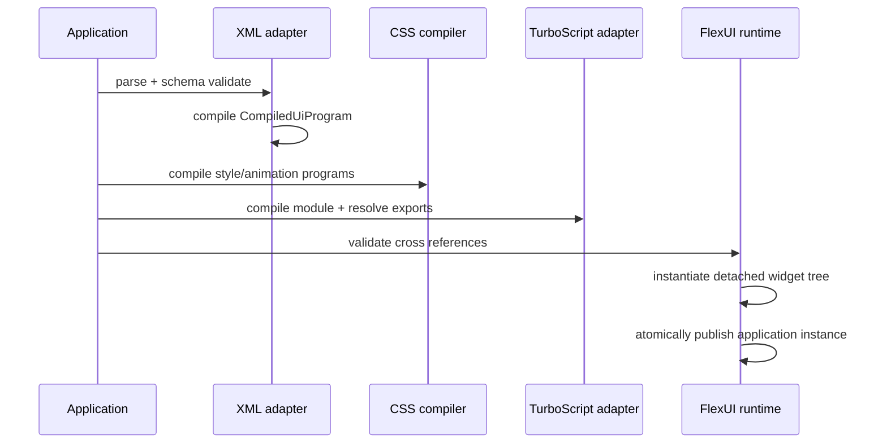

# FlexUI XML、CSS 与 TurboScript 架构决策

状态：已采用
日期：2026-08-31

## 背景

FlexUI 需要形成类似 Qt `.ui` + QtScript 的桌面应用开发模型，但不引入浏览器 DOM、JavaScript
运行时或 npm 生态。现有 `.flex` DSL 同时承载 UI、动画、状态机、资源和表达式，导致文档结构、
交互语言与动画运行时的职责重叠，也让 `Flex::Compiler` 成为 FlexUI 的构建依赖。

## 决策

- XML 是 UI 结构与静态属性的唯一源格式。
- CSS 是视觉、状态样式、transition 和 keyframes 的唯一 cascade；Tailwind CSS utility 采用标准 `class` authoring，并以固定兼容 profile 原生编译到同一 CSS/style pipeline。
- TurboScript（TBS）是交互、应用状态和命令编排的唯一可执行脚本语言；TBS 不创建或遍历一个
  通用 DOM，也不逐帧驱动动画。
- Flex 的原生 Timeline、Track、Curve、显式三次贝塞尔、Physics/Box2D 和数值 MIR 保留为运行时
  能力；它们不属于要删除的 Flex DSL。
- `.flex` parser、lexer、AST、binary DSL format 和 `Flex::Compiler` 在迁移完成后删除。
- XML、CSS/Tailwind 和 TBS 都先编译为不可变程序，再在 UI owner thread 上实例化或执行。
- 有效文本以严格 UTF-8 进入运行时；Unicode 标量、版本化属性和后续 grapheme/word/line/bidi 基础能力统一由 `Salts::Unicode` 提供。FlexUI 不维护第二套 UTF-8 decoder/property fact source。

## 职责与状态归属

| 层 | 主事实源 | 可变性 | 错误边界 |
|---|---|---|---|
| XML adapter | XML source | load/reload 时可替换 | 语法、schema、source location |
| `CompiledUiProgram` | UI definition、事件和 binding 表 | 不可变、可共享 | 语义、资源上限、重复 ID |
| CSS compiler | stylesheet source | load/reload 时可替换 | selector、property、animation 引用 |
| Box/widget tree | 已实例化 UI 状态 | 仅 UI owner thread 修改 | mutation commit |
| TurboScript controller | controller locals | 仅 controller owner thread 修改 | ABI、limits、handler export |
| Timeline/Physics | 动画与物理状态 | runtime owner thread 修改 | 非法参数、缺失 target、资源上限 |

TBS 的一次事件返回一个不可变 effect envelope。宿主先完整校验 `mutations` 与 `commands`，再提交；
校验失败时 Box 与应用服务都不得观察到部分结果。动画的长期状态由原生 runtime 持有，TBS 只发送
类型化的 `play`、`pause`、`seek`、`set_parameter` 等命令。

## 编译与装载顺序

任一阶段失败都立即返回结构化错误。旧实例在 reload 成功提交前继续作为唯一活动实例；不进行静默
降级，也不混用新旧文档的部分产物。

## XML 契约

XML adapter 只负责格式适配，不持有业务状态。元素名称通过 `WidgetRegistry` 映射到带 content/property/event/binding schema 的 node descriptor，再由 descriptor 区分 container、leaf/composite widget、text 与后续 component；具体 widget factory 只负责实例化。未知 tag、重复显式 ID、重复属性和不合法类型均为 load error。纯结构节点允许没有公开 `id`；编译器内部结构身份不得冒充可跨脚本/binding 边界使用的稳定 `UiHandle`。descriptor 同时决定节点是否允许 text、single child、children 或 text+children。通用属性映射到
`UiNodeDefinition::properties`，事件使用 `on:*`，binding 使用 `bind:*`，命名空间在 adapter 边界
转换为现有 canonical key（如 `on.click`、`bind.text`）。资源使用独立、受限的 `<resources>` 区域，
最终产生 `UiResourceDefinition`。

XML 解析采用仓库 vcpkg manifest 已声明的 pugixml，并通过其 CMake imported target 隔离在 adapter
实现内；公共头不暴露 pugixml 类型。上游接口与解析行为参考
[pugixml manual](https://pugixml.org/docs/manual.html)。

`WidgetRegistry` 是实例化的唯一工厂事实源。内置 widget 在启动时显式注册；插件只能通过版本化
宿主接口注册 factory，不得把第三方类型或 native pointer 写入 XML IR。

当前 `WidgetRegistry::builtins()` 显式注册：

- 结构元素：`div`、`span`、`main`、`section`、`article`、`header`、`footer`、`nav`、
  `aside`、`form`、`fieldset`、`legend`、`p`、`a`、`ul`、`ol`、`li`、`window`、`view`、
  `box`、`content`。
- 基础控件：`button`、`label`、`input`、`checkbox`、`radio`、`switch`、`slider`、
  `progress`、`textarea`、`select`、`image`。
- 组合控件：`tooltip`、`modal`、`tabs`、`badge`、`spinner`、`divider`、`toast`、
  `dropdown`、`accordion`、`calendar`、`table`、`tree`、`colorpicker`、`group-button`、
  `toggle-group`、`avatar`、`card`、`breadcrumb`、`pagination`、`stepper`、
  `gradient-editor`、`markdown`。

基础控件 factory 消费已类型化的常用属性，例如 `text`、`value`、`placeholder`、`disabled`、
`checked`、`min/max/step`。类型不匹配返回 `WidgetFactoryFailed`。Registry 通过实例化入口显式注入；
不带 Registry 的旧入口继续创建通用 `Element`，只用于迁移兼容。

## Text 与 Unicode 契约

- UI/XML/TurboScript/application 边界只接受有效 UTF-8；非法输入返回结构化错误，不静默替换为 U+FFFD。
- `Salts::Unicode` 是 UTF-8 scalar/versioned Unicode property 的唯一事实源。FlexUI 现有手写 UTF-8 decoder、emoji range 和 broad bidi range 仅视为迁移遗留。
- source/storage offset 明确以 byte 表示；caret、delete、selection 和用户可见 truncate 使用 grapheme boundary。
- 不隐式执行 NFC/NFD normalization。需要 normalization 时必须是显式 API/authoring decision。
- GUI text 在 scalar 之上还需要 UAX #29 grapheme/word、UAX #14 line break 和 UAX #9 bidi；这些能力应扩展到共享 Unicode 层而不是写入 FlexUI 私有表。
- CSS typography/paragraph layout 属于 FlexUI；font/glyph/GPU resources 与最终 draw submission 属于 shaping/gCanvas 边界。生产 layout 最终不得依赖 byte/codepoint-count 的 approximate width。

## Tailwind CSS compatibility 契约

Tailwind 不是第二套 style runtime。标准 `class="..."` 同时承载普通 semantic class 和 Tailwind candidates；识别出的 utility 生成规则进入现有 `StyleEngine` cascade，普通 class 保留给应用 CSS。

目标兼容固定的 Tailwind v4 profile，包括在 FlexUI CSS 能力可表达范围内的 utility、variant stacking、responsive breakpoint、dark mode、data/aria variant、container query、arbitrary value 和 theme variable。识别但运行时无法表达的浏览器专属行为必须显式 `Unsupported`，不得赋予 Stun 私有的不同语义。官方 Tailwind compiler 可以作为开发期 differential-test oracle，但不是安装后 runtime dependency。

当前 `utility_whitelist.json` / exact-token catalog 是迁移实现与 coverage 数据，不再定义长期公开 Tailwind 语义。迁移期间仍通过生成 CSS 进入 `StyleEngine`，保持单一 cascade；只有 benchmark/profile 证明必要时才考虑直接 Style IR lowering。

## 表达式策略

短期保留现有数值 MIR 作为 CSS animation、binding 与原生 runtime 的编译后执行后端。这不是保留
Flex DSL：用户不再编写 `.flex` 文档，MIR 也不负责 UI 结构或事件编排。

如果后续要求所有表达式都使用 TBS 语法，应在 TurboScript 仓库提供受限的 pure-expression profile：
禁止 I/O、宿主调用、分配和循环，编译一次后通过类型化输入槽执行。该能力可替换表达式前端，但不应
让完整 TBS VM 进入每帧逐属性热路径。在 TurboScript 提供并通过数值一致性与 benchmark 验证前，
不得假定该 API 已存在。

## 兼容性与迁移

迁移期间采用双前端、单 IR：旧 `.flex` parser 与 XML adapter 都只能输出同一个
`UiDocumentDefinition`/`CompiledUiProgram`，后续实例化、binding、事件和测试完全共享。双前端是有
移除期限的迁移机制，不是长期公开能力。

删除旧 DSL 的门槛：

1. FlexUI、FlexPlayer、examples、FlexChart 与工具中的 `.flex` 消费者均已迁移或明确移除。
2. XML 对 UI tree、属性、事件、binding 和资源具备等价测试。
3. CSS/native runtime 对仍需保留的 animation、curve、physics 行为具备回归测试。
4. 安装树不再导出 `Flex::Compiler`、`Flex::DSL` 或 DSL headers。
5. 全仓库 configure/build/test 和 install-tree consumer 验证通过。

回滚以 frontend feature 为单位：XML 成为默认后，旧 parser 可在一个发布周期内由显式兼容选项启用；
它仍输出相同 IR，不维护第二套 runtime。删除 release 之后的回滚只能恢复独立的兼容分支或版本，
不能在主线重新引入双事实源。

## 当前实现与风险

- `事实`：`DesktopApplicationBuilder::xml_entry()` 已是默认入口，并默认注入
  `WidgetRegistry::builtins()`；TurboScript 通过 `ScriptModuleFactory` 注入，因此 Core 公共边界不暴露
  TurboScript 类型。候选只有在 strict CSS、typed widget、required export 与 mount 全部成功后发布。
- `事实`：`DesktopApplication::reload()` 在 owner thread 构建完整候选并一次交换；失败保持活动
  Box/program/controller，跨线程调用返回 `WrongThread`。
- `事实`：`DesktopApplication::dispatch_event()` 已将 hit-test、widget consumption、native callback、
  target→ancestor bubbling 与 controller 串成同步 owner-thread 链路。被 widget 消费的事件默认不进入
  脚本；成功 click 快照同时包含原始 `target` 与绑定节点 `current_target`。
- `HIGH`（事实）：多个工具、示例和模块仍直接消费 `.flex`；立即删除 parser 会破坏公开构建与示例。
- `MED`（事实）：当前 XML event schema 尚未提供“即使 widget 已消费也发送只读通知”的显式选项；
  focus/capture 的完整组合矩阵也仍待补齐，因此 consumed event 统一 fail-closed 为不进入脚本。
- `MED`（事实）：DesktopHost/native window、plugin service 与 application package loader 尚未进入
  当前 Facade；现有实现验证的是 headless application candidate 事务。
- `MED`（推论）：完整 TBS VM 若逐帧求每个属性，会增加调用、分配与 ABI 成本。依据是当前架构的
  per-frame native Timeline 热路径；需以 benchmark 决定是否增加 pure-expression profile。
- `LOW`（常用做法）：XML/CSS/TBS 的职责分离更接近成熟桌面 UI 工具链，但本决策的主要依据仍是
  仓库现有 IR、runtime 与 controller 边界，而不是形式相似性。
